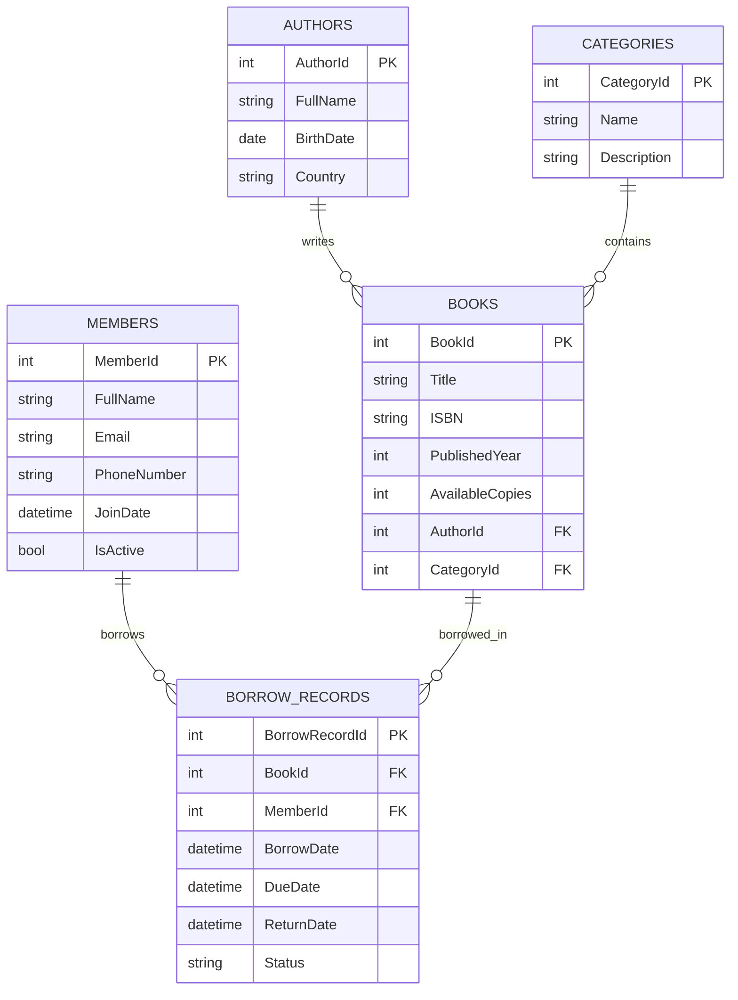
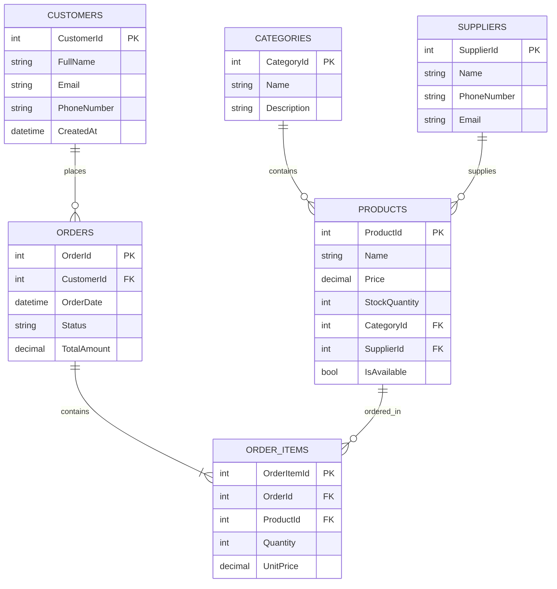
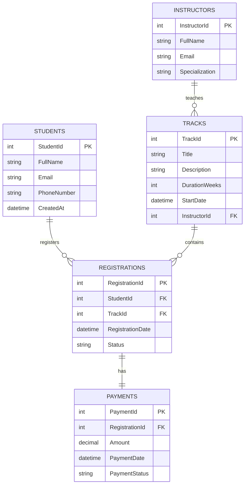

# Task 06 - SQL & ERD Starter

This directory contains the database design schemas and SQL query scripts for Scenario A, Scenario B, and Scenario C of the relational database exercises.

As requested, each scenario's SQL code (`schema.sql` and `queries.sql`) is stored in its own separate directory:
- [Scenario A: Library Management System](file:///c:/Users/user/Desktop/Tech_Master/techmaster-aspnet-backend-training/phase-01-backend-foundations/task-06-sql-erd-starter/scenario-a-library/)
- [Scenario B: Simple Store & Orders System](file:///c:/Users/user/Desktop/Tech_Master/techmaster-aspnet-backend-training/phase-01-backend-foundations/task-06-sql-erd-starter/scenario-b-store/)
- [Scenario C: Training Center Registration System](file:///c:/Users/user/Desktop/Tech_Master/techmaster-aspnet-backend-training/phase-01-backend-foundations/task-06-sql-erd-starter/scenario-c-training/)

Below is the complete database design explanation, entity breakdown, relationships, visual ERDs, and architectural rationale for all three scenarios.

---

## Scenario A: Library Management System

### Main Entities
- **Authors**: Stores metadata about book writers (Full Name, Birth Date, Country).
- **Categories**: Logical catalog groupings for books (e.g., Fiction, Science).
- **Books**: Contains book catalog metadata, copy availability counts, and mappings to its category and author.
- **Members**: Profiles for active library users and their join date.
- **BorrowRecords**: Junction transactions record tracking which members borrow which books and their return dates.

### Entity Relationship Diagram (ERD)

### Relationships
- **Author 1 -> Many Books**: An author can write multiple books, but each book has one author.
- **Category 1 -> Many Books**: A category contains multiple books, and each book belongs to one category.
- **Member 1 -> Many BorrowRecords**: A member can borrow multiple books over time.
- **Book 1 -> Many BorrowRecords**: A book can be checked out multiple times by different members.

### Why I Designed It This Way
The Library Management System is designed using standard Third Normal Form (3NF) to separate independent concerns. Storing `Authors` and `Categories` in lookup tables avoids duplicate text values in the `Books` catalog. The core transaction table `BorrowRecords` resolves the many-to-many relationship between `Members` and `Books`. It captures key transaction dates (`BorrowDate`, `DueDate`, and `ReturnDate`) and a dynamic `Status` flag. Indexes on `MemberId` and `BookId` within `BorrowRecords` optimize transaction log queries, such as checking a member's history or identifying overdue books.

---

## Scenario B: Simple Store & Orders System

### Main Entities
- **Customers**: Stores shopper profile details, email address, phone, and account creation dates.
- **Categories**: Organizes store products into high-level groupings.
- **Suppliers**: Captures external supplier contact details and sourcing records.
- **Products**: Stores retail item attributes, pricing, stock quantity, and availability.
- **Orders**: Tracks customer transaction headers, placement dates, and transaction totals.
- **OrderItems**: Associative table tracking specific items, quantities, and historical prices for each order line.

### Entity Relationship Diagram (ERD)

### Relationships
- **Customer 1 -> Many Orders**: A customer can place multiple orders over time, but each order is placed by exactly one customer.
- **Order 1 -> Many OrderItems**: An order consists of one or more product line items, with each line item belonging to only one order.
- **Product 1 -> Many OrderItems**: A product can appear as a line item across multiple different orders.
- **Category 1 -> Many Products**: A category contains multiple products, and each product belongs to exactly one category.
- **Supplier 1 -> Many Products**: A supplier provides multiple products, and each product is sourced from one supplier.

### Why I Designed It This Way
To build a scalable and normalizeable store system, the schema is structured to comply with Third Normal Form (3NF) to eliminate data redundancy. 
A key design decision is using `OrderItems` as an associative (junction) table to decouple the many-to-many relationship between `Orders` and `Products`. 
By storing both `Quantity` and a historical `UnitPrice` in `OrderItems` at the moment of order placement, we freeze the transaction details. This ensures that subsequent modifications to a product's price in the main `Products` table do not retroactively alter the total amounts of historical orders. 
Additionally, status fields (e.g., `Status` in `Orders`) and soft-deactivation capabilities (e.g., `IsAvailable` in `Products`) ensure transaction durability and reporting accuracy.

---

## Scenario C: Training Center Registration System

### Main Entities
- **Students**: Holds profiles of individuals enrolled in training center courses.
- **Instructors**: Holds instructor contact details and academic specializations.
- **Tracks**: Represents technical courses, duration, and the supervising instructor.
- **Registrations**: Associates a student to a course track at a specific date.
- **Payments**: Represents financial billing linked directly to course registrations.

### Entity Relationship Diagram (ERD)

### Relationships
- **Instructor 1 -> Many Tracks**: An instructor can teach multiple tracks, but each track has one instructor.
- **Student 1 -> Many Registrations**: A student can register for multiple course tracks.
- **Track 1 -> Many Registrations**: A course track can accept registrations from many students.
- **Registration 1 -> One Payment**: A course registration has exactly one payment profile (unpaid, partially paid, or paid).

### Why I Designed It This Way
To support registration and financial tracking, the system separates core profiles (Students and Instructors) from course structures (Tracks). Registrations act as the transaction junction connecting Students and Tracks. A key design choice is separating `Registrations` and `Payments` with a 1-to-1 relationship. While a registration could theoretically contain financial fields, separating them into `Payments` allows the payment history, payment methods, transaction timestamps, and specific receipt data to be managed cleanly without cluttering the course enrollment record. Checked constraints on `DurationWeeks` and unique indices on `Email` prevent invalid data entries.
