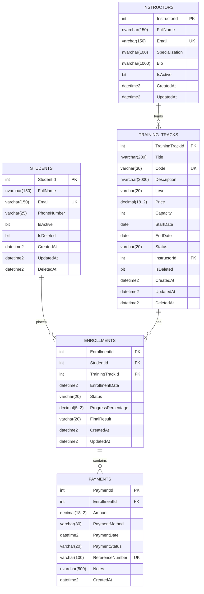
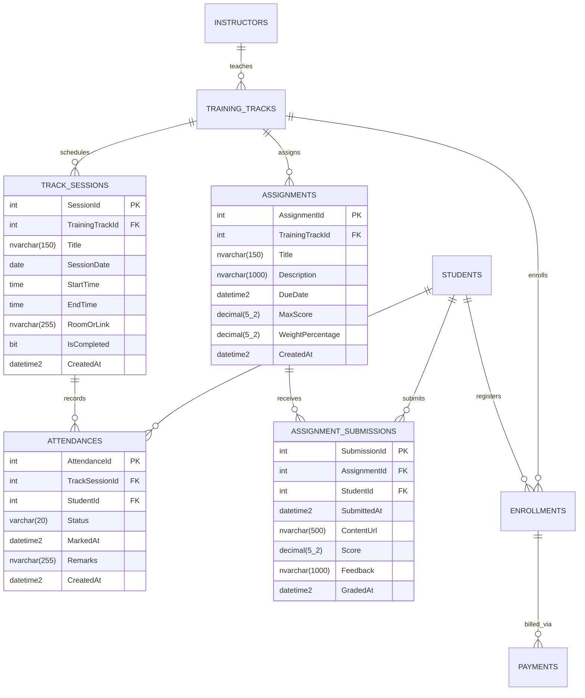

# Task 02: Business Requirements to Database ERD & Relational Schema

> **Phase 03: Real Backend Data Systems • TechMaster Academy**  
> **Topic:** Requirement Analysis, Relational Entity Relationship Diagram (ERD), Database Normalization, EF Core Mapping, and Business Query Engine.  
> **Score Target:** 100/100 (Top Student Production Standard)

---

## 📑 Table of Contents
1. [Business Story & System Scope](#1-business-story--system-scope)
2. [Domain Entities & Attributes Specification](#2-domain-entities--attributes-specification)
3. [Relational Data Dictionary (Data Dictionary & Constraints)](#3-relational-data-dictionary)
4. [Entity Relationship Diagrams (ERD)](#4-entity-relationship-diagrams-erd)
   - [Core Domain ERD](#41-core-domain-erd)
   - [Extended Bonus Domain ERD (Sessions, Attendance, Assignments)](#42-extended-bonus-domain-erd)
   - [ASCII Relational Schema Matrix](#43-ascii-relational-schema-matrix)
5. [Relationships, Cardinalities & Referential Integrity](#5-relationships-cardinalities--referential-integrity)
6. [Design Decisions & Architecture Rationale](#6-design-decisions--architecture-rationale)
7. [The 10 Core Business Questions & Query Implementations](#7-the-10-core-business-questions--query-implementations)
8. [EF Core Production Implementation Overview](#8-ef-core-production-implementation-overview)
9. [Deliverables Manifest](#9-deliverables-manifest)

---

## 1. Business Story & System Scope

### 🏢 The Business Context
TechMaster Academy is scaling its enterprise training programs and requires an internal, high-integrity backend data system to manage students, instructors, training tracks, enrollments, and payment operations.

### 📋 Requirement Extraction Summary
* **Students:** Multiple students register in the system. A student can enroll in multiple training tracks over time.
* **Instructors:** Instructors teach tracks. Each track is led by one main instructor, while an instructor can lead multiple tracks concurrently or sequentially.
* **Training Tracks:** Training tracks represent cohorts/courses with defined capacity, difficulty level, start and end dates, status, and associated cost/tuition.
* **Enrollments:** The associative entity linking a student to a training track. It tracks enrollment date, status, student progress percentage, and final grade/certification result.
* **Payments:** Enrollments require financial settlement. Students may pay in one lump sum or through installments. Each payment records amount, payment method, transaction date, payment status, and an external unique reference number.
* **Bonus Operational Modules:**
  * **Track Sessions:** Individual lecture/workshop schedule for each track.
  * **Attendance:** Session-by-session student presence tracking.
  * **Assignments & Submissions:** Deliverables, max scores, weights, student submissions, scores, and instructor feedback.

---

## 2. Domain Entities & Attributes Specification

| Entity | Primary Key | Key Business Attributes | Audit & Lifecycle Fields |
| :--- | :--- | :--- | :--- |
| **Student** | `StudentId` (INT PK) | `FullName`, `Email` (Unique), `PhoneNumber` | `IsActive`, `IsDeleted`, `CreatedAt` (UTC), `UpdatedAt` (UTC), `DeletedAt` (UTC) |
| **Instructor** | `InstructorId` (INT PK) | `FullName`, `Email` (Unique), `Specialization`, `Bio` | `IsActive`, `CreatedAt` (UTC), `UpdatedAt` (UTC) |
| **TrainingTrack** | `TrainingTrackId` (INT PK) | `Title`, `Code` (Unique), `Description`, `Level`, `Price`, `Capacity`, `StartDate`, `EndDate`, `Status`, `InstructorId` (FK) | `IsDeleted`, `CreatedAt` (UTC), `UpdatedAt` (UTC), `DeletedAt` (UTC) |
| **Enrollment** | `EnrollmentId` (INT PK) | `StudentId` (FK), `TrainingTrackId` (FK), `EnrollmentDate`, `Status`, `ProgressPercentage`, `FinalResult` | `CreatedAt` (UTC), `UpdatedAt` (UTC) |
| **Payment** | `PaymentId` (INT PK) | `EnrollmentId` (FK), `Amount` (Decimal 18,2), `PaymentMethod`, `PaymentDate`, `PaymentStatus`, `ReferenceNumber` (Unique), `Notes` | `CreatedAt` (UTC) |
| **TrackSession** *(Bonus)* | `SessionId` (INT PK) | `TrainingTrackId` (FK), `Title`, `SessionDate`, `StartTime`, `EndTime`, `RoomOrLink`, `IsCompleted` | `CreatedAt` (UTC) |
| **Attendance** *(Bonus)* | `AttendanceId` (INT PK) | `TrackSessionId` (FK), `StudentId` (FK), `Status`, `MarkedAt`, `Remarks` | `CreatedAt` (UTC) |
| **Assignment** *(Bonus)* | `AssignmentId` (INT PK) | `TrainingTrackId` (FK), `Title`, `Description`, `DueDate`, `MaxScore`, `WeightPercentage` | `CreatedAt` (UTC) |
| **AssignmentSubmission** *(Bonus)* | `SubmissionId` (INT PK) | `AssignmentId` (FK), `StudentId` (FK), `SubmittedAt`, `ContentUrl`, `Score`, `Feedback` | `GradedAt` (UTC) |

---

## 3. Relational Data Dictionary

### 3.1 Table: `Students`
Stores registered learners eligible for enrollment.

| Column Name | SQL Data Type | Nullability | Constraints / Defaults | Business Description |
| :--- | :--- | :---: | :--- | :--- |
| `StudentId` | `INT IDENTITY(1,1)` | NOT NULL | **PK**, Clustered | Unique student surrogate identifier. |
| `FullName` | `NVARCHAR(150)` | NOT NULL | Length: 1-150 | Full legal name of the student. |
| `Email` | `VARCHAR(150)` | NOT NULL | **UNIQUE INDEX** | Primary contact and login email. |
| `PhoneNumber` | `VARCHAR(25)` | NULL | Regex check E.164 | Contact mobile number with country code. |
| `IsActive` | `BIT` | NOT NULL | DEFAULT `1` | Indicates whether account is in good standing. |
| `IsDeleted` | `BIT` | NOT NULL | DEFAULT `0` | Soft delete flag for student record. |
| `CreatedAt` | `DATETIME2(7)` | NOT NULL | DEFAULT `SYSUTCDATETIME()` | UTC timestamp of student registration. |
| `UpdatedAt` | `DATETIME2(7)` | NULL | | UTC timestamp of last record modification. |
| `DeletedAt` | `DATETIME2(7)` | NULL | | UTC timestamp when soft-deletion occurred. |

### 3.2 Table: `Instructors`
Stores academic mentors and track leaders.

| Column Name | SQL Data Type | Nullability | Constraints / Defaults | Business Description |
| :--- | :--- | :---: | :--- | :--- |
| `InstructorId` | `INT IDENTITY(1,1)` | NOT NULL | **PK**, Clustered | Unique instructor surrogate identifier. |
| `FullName` | `NVARCHAR(150)` | NOT NULL | Length: 1-150 | Full legal name of the instructor. |
| `Email` | `VARCHAR(150)` | NOT NULL | **UNIQUE INDEX** | Official academy email address. |
| `Specialization` | `NVARCHAR(100)` | NOT NULL | | Primary domain (e.g. .NET Backend, Cloud). |
| `Bio` | `NVARCHAR(1000)` | NULL | | Professional biography and qualifications. |
| `IsActive` | `BIT` | NOT NULL | DEFAULT `1` | Active employment/contract status. |
| `CreatedAt` | `DATETIME2(7)` | NOT NULL | DEFAULT `SYSUTCDATETIME()` | UTC timestamp of instructor onboarding. |
| `UpdatedAt` | `DATETIME2(7)` | NULL | | UTC timestamp of last profile modification. |

### 3.3 Table: `TrainingTracks`
Stores courses/cohorts offered by the academy.

| Column Name | SQL Data Type | Nullability | Constraints / Defaults | Business Description |
| :--- | :--- | :---: | :--- | :--- |
| `TrainingTrackId` | `INT IDENTITY(1,1)` | NOT NULL | **PK**, Clustered | Unique track surrogate identifier. |
| `Title` | `NVARCHAR(200)` | NOT NULL | Length: 1-200 | Descriptive title of the track. |
| `Code` | `VARCHAR(30)` | NOT NULL | **UNIQUE INDEX** | Standard track code (e.g. `NET-BE-2026`). |
| `Description` | `NVARCHAR(2000)`| NULL | | Syllabus and track overview. |
| `Level` | `VARCHAR(20)` | NOT NULL | `CHECK (Level IN ('Beginner', 'Intermediate', 'Advanced'))` | Difficulty tier of the course. |
| `Price` | `DECIMAL(18,2)` | NOT NULL | `CHECK (Price >= 0)`, DEFAULT `0.00` | Tuition cost for enrolling in this track. |
| `Capacity` | `INT` | NOT NULL | `CHECK (Capacity > 0)` | Maximum allowed enrolled students. |
| `StartDate` | `DATE` | NOT NULL | | Track official start date. |
| `EndDate` | `DATE` | NOT NULL | `CHECK (EndDate >= StartDate)` | Track graduation/completion date. |
| `Status` | `VARCHAR(20)` | NOT NULL | `CHECK (Status IN ('Draft', 'Upcoming', 'InProgress', 'Completed', 'Cancelled'))` | Lifecycle stage of the track. |
| `InstructorId` | `INT` | NOT NULL | **FK** -> `Instructors.InstructorId` (`ON DELETE RESTRICT`) | Assigned lead instructor. |
| `IsDeleted` | `BIT` | NOT NULL | DEFAULT `0` | Soft delete flag for deactivated tracks. |
| `CreatedAt` | `DATETIME2(7)` | NOT NULL | DEFAULT `SYSUTCDATETIME()` | UTC creation timestamp. |
| `UpdatedAt` | `DATETIME2(7)` | NULL | | UTC last modification timestamp. |
| `DeletedAt` | `DATETIME2(7)` | NULL | | UTC soft-delete timestamp. |

### 3.4 Table: `Enrollments`
Associative join entity modeling student-to-track enrollment lifecycle.

| Column Name | SQL Data Type | Nullability | Constraints / Defaults | Business Description |
| :--- | :--- | :---: | :--- | :--- |
| `EnrollmentId` | `INT IDENTITY(1,1)` | NOT NULL | **PK**, Clustered | Unique enrollment surrogate identifier. |
| `StudentId` | `INT` | NOT NULL | **FK** -> `Students.StudentId` (`ON DELETE RESTRICT`) | Enrolled student ID. |
| `TrainingTrackId` | `INT` | NOT NULL | **FK** -> `TrainingTracks.TrainingTrackId` (`ON DELETE RESTRICT`) | Selected training track ID. |
| `EnrollmentDate` | `DATETIME2(7)` | NOT NULL | DEFAULT `SYSUTCDATETIME()` | Date and time when enrollment was booked. |
| `Status` | `VARCHAR(20)` | NOT NULL | `CHECK (Status IN ('Pending', 'Active', 'Completed', 'Dropped', 'Suspended'))` | Enrollment state. |
| `ProgressPercentage`| `DECIMAL(5,2)` | NOT NULL | `CHECK (ProgressPercentage BETWEEN 0.00 AND 100.00)`, DEFAULT `0.00` | Academic curriculum progress. |
| `FinalResult` | `VARCHAR(20)` | NULL | `CHECK (FinalResult IN ('Pass', 'Fail', 'Distinction', 'Incomplete', NULL))` | Final grade/completion assessment. |
| `CreatedAt` | `DATETIME2(7)` | NOT NULL | DEFAULT `SYSUTCDATETIME()` | UTC record creation timestamp. |
| `UpdatedAt` | `DATETIME2(7)` | NULL | | UTC last update timestamp. |
| *Composite Unique* | *(StudentId, TrainingTrackId)* | NOT NULL | **UNIQUE INDEX** | Prevents duplicate enrollments per student/track. |

### 3.5 Table: `Payments`
Stores financial transactions credited toward an enrollment.

| Column Name | SQL Data Type | Nullability | Constraints / Defaults | Business Description |
| :--- | :--- | :---: | :--- | :--- |
| `PaymentId` | `INT IDENTITY(1,1)` | NOT NULL | **PK**, Clustered | Unique payment surrogate identifier. |
| `EnrollmentId` | `INT` | NOT NULL | **FK** -> `Enrollments.EnrollmentId` (`ON DELETE CASCADE`) | Linked enrollment target. |
| `Amount` | `DECIMAL(18,2)` | NOT NULL | `CHECK (Amount > 0.00)` | Financial transaction value. |
| `PaymentMethod` | `VARCHAR(30)` | NOT NULL | `CHECK (PaymentMethod IN ('CreditCard', 'BankTransfer', 'Cash', 'VodafoneCash', 'Fawry', 'Stripe'))` | Processing channel. |
| `PaymentDate` | `DATETIME2(7)` | NOT NULL | DEFAULT `SYSUTCDATETIME()` | Timestamp of payment transaction. |
| `PaymentStatus` | `VARCHAR(20)` | NOT NULL | `CHECK (PaymentStatus IN ('Pending', 'Completed', 'Failed', 'Refunded'))` | Settlement status. |
| `ReferenceNumber` | `VARCHAR(100)` | NOT NULL | **UNIQUE INDEX** | Gateway transaction or receipt reference. |
| `Notes` | `NVARCHAR(500)` | NULL | | Optional audit memo or bank comments. |
| `CreatedAt` | `DATETIME2(7)` | NOT NULL | DEFAULT `SYSUTCDATETIME()` | System record insertion timestamp. |

---

## 4. Entity Relationship Diagrams (ERD)

### 4.1 Core Domain ERD



---

### 4.2 Extended Bonus Domain ERD

Includes the bonus operational entities: **TrackSession**, **Attendance**, **Assignment**, and **AssignmentSubmission**.



---

### 4.3 ASCII Relational Schema Matrix

```text
========================================================================================================================
                                       TECHMASTER ACADEMY RELATIONAL SCHEMA
========================================================================================================================

+----------------------------------+          1 : N          +-----------------------------------+
|            INSTRUCTORS           | ----------------------> |          TRAINING_TRACKS          |
+----------------------------------+                         +-----------------------------------+
| PK  InstructorId   INT           |                         | PK  TrainingTrackId  INT          |
|     FullName       NVARCHAR(150) |                         |     Title            NVARCHAR(200)|
| UQ  Email          VARCHAR(150)  |                         | UQ  Code             VARCHAR(30)  |
|     Specialization NVARCHAR(100) |                         |     Level            VARCHAR(20)  |
|     Bio            NVARCHAR(1000)|                         |     Price            DECIMAL(18,2)|
|     IsActive       BIT           |                         |     Capacity         INT          |
|     CreatedAt      DATETIME2     |                         |     StartDate        DATE         |
+----------------------------------+                         |     EndDate          DATE         |
                                                             |     Status           VARCHAR(20)  |
                                                             | FK  InstructorId     INT          |
                                                             |     IsDeleted        BIT          |
                                                             +-----------------------------------+
                                                                               |
                                                                               | 1 : N
                                                                               v
+----------------------------------+          1 : N          +-----------------------------------+
|             STUDENTS             | ----------------------> |            ENROLLMENTS            |
+----------------------------------+                         +-----------------------------------+
| PK  StudentId      INT           |                         | PK  EnrollmentId     INT          |
|     FullName       NVARCHAR(150) |                         | FK  StudentId        INT          |
| UQ  Email          VARCHAR(150)  |                         | FK  TrainingTrackId  INT          |
|     PhoneNumber    VARCHAR(25)   |                         |     EnrollmentDate   DATETIME2    |
|     IsActive       BIT           |                         |     Status           VARCHAR(20)  |
|     IsDeleted      BIT           |                         |     ProgressPct      DECIMAL(5,2) |
|     CreatedAt      DATETIME2     |                         |     FinalResult      VARCHAR(20)  |
|     DeletedAt      DATETIME2     |                         | UQ (StudentId, TrainingTrackId)   |
+----------------------------------+                         +-----------------------------------+
                                                                               |
                                                                               | 1 : N
                                                                               v
                                                             +-----------------------------------+
                                                             |             PAYMENTS              |
                                                             +-----------------------------------+
                                                             | PK  PaymentId        INT          |
                                                             | FK  EnrollmentId     INT          |
                                                             |     Amount           DECIMAL(18,2)|
                                                             |     PaymentMethod    VARCHAR(30)  |
                                                             |     PaymentDate      DATETIME2    |
                                                             |     PaymentStatus    VARCHAR(20)  |
                                                             | UQ  ReferenceNumber  VARCHAR(100) |
                                                             |     Notes            NVARCHAR(500)|
                                                             +-----------------------------------+
========================================================================================================================
```

---

## 5. Relationships, Cardinalities & Referential Integrity

### 5.1 Relationship Specifications Matrix

| Relationship | Type | Parent (Principal) | Child (Dependent) | FK Column | Cascade Rule | Business Meaning |
| :--- | :---: | :--- | :--- | :--- | :--- | :--- |
| **Instructor -> TrainingTrack** | 1 : N | `Instructors` | `TrainingTracks` | `InstructorId` | `ON DELETE RESTRICT` (NO ACTION) | An instructor can teach zero to many tracks. A track must have exactly one instructor. An instructor cannot be deleted if active tracks exist. |
| **Student -> Enrollment** | 1 : N | `Students` | `Enrollments` | `StudentId` | `ON DELETE RESTRICT` (NO ACTION) | A student can register for multiple tracks. A student record cannot be hard-deleted if enrollment history exists. |
| **TrainingTrack -> Enrollment** | 1 : N | `TrainingTracks` | `Enrollments` | `TrainingTrackId` | `ON DELETE RESTRICT` (NO ACTION) | A track contains multiple student enrollments. Tracks with enrolled students are protected from deletion. |
| **Enrollment -> Payment** | 1 : N | `Enrollments` | `Payments` | `EnrollmentId` | `ON DELETE CASCADE` | An enrollment can have multiple payments (installment plan). Removing an enrollment removes its payment records. |
| **Track -> TrackSession** *(Bonus)* | 1 : N | `TrainingTracks` | `TrackSessions` | `TrainingTrackId` | `ON DELETE CASCADE` | A track consists of multiple scheduled sessions. |
| **Session -> Attendance** *(Bonus)* | 1 : N | `TrackSessions` | `Attendances` | `TrackSessionId` | `ON DELETE CASCADE` | A session logs attendance for all enrolled students. |
| **Student -> Attendance** *(Bonus)* | 1 : N | `Students` | `Attendances` | `StudentId` | `ON DELETE RESTRICT` | A student has multiple session attendance records. |
| **Track -> Assignment** *(Bonus)* | 1 : N | `TrainingTracks` | `Assignments` | `TrainingTrackId` | `ON DELETE CASCADE` | A track publishes multiple assignments. |
| **Assignment -> Submission** *(Bonus)* | 1 : N | `Assignments` | `AssignmentSubmissions` | `AssignmentId` | `ON DELETE CASCADE` | An assignment receives submissions from students. |
| **Student -> Submission** *(Bonus)* | 1 : N | `Students` | `AssignmentSubmissions` | `StudentId` | `ON DELETE RESTRICT` | A student submits work for various assignments. |

---

## 6. Design Decisions & Architecture Rationale

### 6.1 Database Normalization Compliance (3NF Analysis)
1. **First Normal Form (1NF):**
   - All columns hold atomic, scalar values (no CSV strings or nested JSON arrays for payments or phone numbers).
   - Each table has a distinct surrogate Primary Key (`StudentId`, `InstructorId`, etc.).
2. **Second Normal Form (2NF):**
   - The design is in 1NF.
   - All non-key attributes are fully functionally dependent on the entire primary key (no partial dependencies). In `Enrollments`, fields like `ProgressPercentage` and `Status` depend on the composite pair `(StudentId, TrainingTrackId)` encapsulated by surrogate `EnrollmentId`.
3. **Third Normal Form (3NF):**
   - The design is in 2NF.
   - There are no transitive dependencies. For example, `Instructor` details (`Specialization`, `Bio`) reside in `Instructors`, not copied into `TrainingTracks`. `Price` belongs to `TrainingTrack`, and `Amount` belongs to `Payments`.

### 6.2 Financial Precision Standard
- All monetary fields (`TrainingTracks.Price`, `Payments.Amount`) use `DECIMAL(18,2)` to avoid floating-point rounding errors inherent to `FLOAT`/`DOUBLE`.

### 6.3 Auditability & Soft Delete Architecture
- Temporal tracking is standardized to **UTC** using `DATETIME2(7)` with default `SYSUTCDATETIME()`.
- Critical domain entities (`Students`, `TrainingTracks`) implement soft deletion (`IsDeleted`, `DeletedAt`). In EF Core, this is paired with Global Query Filters: `.HasQueryFilter(e => !e.IsDeleted)`.

### 6.4 Preventing Duplicate Enrollments
- A composite unique index on `Enrollments (StudentId, TrainingTrackId)` guarantees at the database engine level that a student cannot be enrolled in the same track twice.

### 6.5 Installment Payment Architecture
- One `Enrollment` has zero-to-many `Payments`. This allows:
  - Full upfront payment (1 payment = track price).
  - Multi-installment payment schedules (e.g., 3 payments totaling track price).
  - Partial payments and status tracking (`Pending`, `Completed`, `Failed`, `Refunded`).

---

## 7. The 10 Core Business Questions & Query Implementations

Here is the exact mapping of business requirements to production SQL queries:

### ❓ Question 1: Which students are enrolled in a specific track?
```sql
SELECT 
    s.StudentId,
    s.FullName,
    s.Email,
    s.PhoneNumber,
    e.EnrollmentDate,
    e.Status AS EnrollmentStatus,
    e.ProgressPercentage
FROM Enrollments e
INNER JOIN Students s ON e.StudentId = s.StudentId
INNER JOIN TrainingTracks t ON e.TrainingTrackId = t.TrainingTrackId
WHERE t.Code = 'NET-BE-2026' AND s.IsDeleted = 0
ORDER BY s.FullName ASC;
```

---

### ❓ Question 2: Which tracks have available seats?
```sql
SELECT 
    t.TrainingTrackId,
    t.Code,
    t.Title,
    t.Capacity,
    COUNT(e.EnrollmentId) AS EnrolledStudentsCount,
    (t.Capacity - COUNT(e.EnrollmentId)) AS AvailableSeats
FROM TrainingTracks t
LEFT JOIN Enrollments e ON t.TrainingTrackId = e.TrainingTrackId 
    AND e.Status IN ('Active', 'Pending')
WHERE t.IsDeleted = 0
GROUP BY t.TrainingTrackId, t.Code, t.Title, t.Capacity
HAVING COUNT(e.EnrollmentId) < t.Capacity
ORDER BY AvailableSeats DESC;
```

---

### ❓ Question 3: Which enrollments are unpaid or partially paid?
```sql
SELECT 
    e.EnrollmentId,
    s.FullName AS StudentName,
    s.Email AS StudentEmail,
    t.Title AS TrackTitle,
    t.Price AS TrackPrice,
    COALESCE(SUM(CASE WHEN p.PaymentStatus = 'Completed' THEN p.Amount ELSE 0 END), 0) AS TotalPaid,
    (t.Price - COALESCE(SUM(CASE WHEN p.PaymentStatus = 'Completed' THEN p.Amount ELSE 0 END), 0)) AS OutstandingBalance
FROM Enrollments e
INNER JOIN Students s ON e.StudentId = s.StudentId
INNER JOIN TrainingTracks t ON e.TrainingTrackId = t.TrainingTrackId
LEFT JOIN Payments p ON e.EnrollmentId = p.EnrollmentId
WHERE e.Status IN ('Active', 'Pending')
GROUP BY e.EnrollmentId, s.FullName, s.Email, t.Title, t.Price
HAVING COALESCE(SUM(CASE WHEN p.PaymentStatus = 'Completed' THEN p.Amount ELSE 0 END), 0) < t.Price
ORDER BY OutstandingBalance DESC;
```

---

### ❓ Question 4: How much revenue did each track generate?
```sql
SELECT 
    t.TrainingTrackId,
    t.Code,
    t.Title,
    COUNT(DISTINCT e.EnrollmentId) AS TotalEnrollments,
    COALESCE(SUM(CASE WHEN p.PaymentStatus = 'Completed' THEN p.Amount ELSE 0 END), 0) AS RealizedRevenue,
    (COUNT(DISTINCT e.EnrollmentId) * t.Price) AS ExpectedRevenue
FROM TrainingTracks t
LEFT JOIN Enrollments e ON t.TrainingTrackId = e.TrainingTrackId
LEFT JOIN Payments p ON e.EnrollmentId = p.EnrollmentId
WHERE t.IsDeleted = 0
GROUP BY t.TrainingTrackId, t.Code, t.Title, t.Price
ORDER BY RealizedRevenue DESC;
```

---

### ❓ Question 5: Which instructor has the highest workload?
```sql
SELECT 
    i.InstructorId,
    i.FullName AS InstructorName,
    i.Specialization,
    COUNT(DISTINCT t.TrainingTrackId) AS ActiveTracksCount,
    COUNT(e.EnrollmentId) AS TotalActiveStudentsSupervised
FROM Instructors i
LEFT JOIN TrainingTracks t ON i.InstructorId = t.InstructorId 
    AND t.IsDeleted = 0 
    AND t.Status IN ('Upcoming', 'InProgress')
LEFT JOIN Enrollments e ON t.TrainingTrackId = e.TrainingTrackId 
    AND e.Status = 'Active'
WHERE i.IsActive = 1
GROUP BY i.InstructorId, i.FullName, i.Specialization
ORDER BY TotalActiveStudentsSupervised DESC, ActiveTracksCount DESC;
```

---

### ❓ Question 6: Which students have active enrollments?
```sql
SELECT DISTINCT
    s.StudentId,
    s.FullName,
    s.Email,
    s.PhoneNumber,
    COUNT(e.EnrollmentId) AS ActiveEnrollmentsCount
FROM Students s
INNER JOIN Enrollments e ON s.StudentId = e.StudentId
WHERE s.IsActive = 1 
  AND s.IsDeleted = 0 
  AND e.Status = 'Active'
GROUP BY s.StudentId, s.FullName, s.Email, s.PhoneNumber
ORDER BY s.FullName ASC;
```

---

### ❓ Question 7: Which tracks start this month?
```sql
SELECT 
    t.TrainingTrackId,
    t.Code,
    t.Title,
    t.StartDate,
    t.EndDate,
    t.Status,
    t.Capacity,
    i.FullName AS InstructorName
FROM TrainingTracks t
INNER JOIN Instructors i ON t.InstructorId = i.InstructorId
WHERE t.IsDeleted = 0
  AND YEAR(t.StartDate) = YEAR(GETUTCDATE())
  AND MONTH(t.StartDate) = MONTH(GETUTCDATE())
ORDER BY t.StartDate ASC;
```

---

### ❓ Question 8: What is the payment history for an enrollment?
```sql
SELECT 
    p.PaymentId,
    p.ReferenceNumber,
    p.Amount,
    p.PaymentMethod,
    p.PaymentDate,
    p.PaymentStatus,
    p.Notes
FROM Payments p
WHERE p.EnrollmentId = @TargetEnrollmentId
ORDER BY p.PaymentDate DESC;
```

---

### ❓ Question 9: Which tracks are full (at capacity)?
```sql
SELECT 
    t.TrainingTrackId,
    t.Code,
    t.Title,
    t.Capacity,
    COUNT(e.EnrollmentId) AS EnrolledCount,
    t.Status
FROM TrainingTracks t
INNER JOIN Enrollments e ON t.TrainingTrackId = e.TrainingTrackId
WHERE t.IsDeleted = 0 
  AND e.Status IN ('Active', 'Pending')
GROUP BY t.TrainingTrackId, t.Code, t.Title, t.Capacity, t.Status
HAVING COUNT(e.EnrollmentId) >= t.Capacity
ORDER BY EnrolledCount DESC;
```

---

### ❓ Question 10: How many enrollments exist by status?
```sql
SELECT 
    e.Status AS EnrollmentStatus,
    COUNT(*) AS TotalCount,
    CAST(COUNT(*) * 100.0 / SUM(COUNT(*)) OVER() AS DECIMAL(5,2)) AS PercentageOfTotal
FROM Enrollments e
GROUP BY e.Status
ORDER BY TotalCount DESC;
```

---

## 8. EF Core Production Implementation Overview

The complete C# EF Core entity models and Fluent API configurations are fully written and organized under the `Entities/` and `Configurations/` subdirectories:

1. **`Entities/Student.cs`**: Strong domain model with encapsulation of `Enrollments`, soft-delete tracking, and unique email constraints.
2. **`Entities/Instructor.cs`**: Principal instructor entity with read-only collections for assigned `TrainingTracks`.
3. **`Entities/TrainingTrack.cs`**: Track cohort entity with capacity, level, date bounds, and price.
4. **`Entities/Enrollment.cs`**: Associative entity linking student and track with progress percentage and collection of `Payments`.
5. **`Entities/Payment.cs`**: Financial ledger entity with `decimal(18,2)` precision, unique reference numbers, and payment status.
6. **Bonus Models (`Entities/Bonus/`)**: `TrackSession.cs`, `Attendance.cs`, `Assignment.cs`, `AssignmentSubmission.cs`.
7. **Fluent API Configurations (`Configurations/`)**: Fully isolated `IEntityTypeConfiguration<T>` classes guaranteeing exact index creation, check constraints, default values, and foreign key rules.

---

## 9. Deliverables Manifest

| Deliverable File | Description |
| :--- | :--- |
| **[README.md](file:///c:/Users/user/Desktop/Tech_Master/techmaster-aspnet-backend-training/phase-03-real-backend-data-systems/task-02-requirements-to-erd/README.md)** | Full technical documentation, data dictionary, design rationale, and report queries. |
| **[erd-diagram.md](file:///c:/Users/user/Desktop/Tech_Master/techmaster-aspnet-backend-training/phase-03-real-backend-data-systems/task-02-requirements-to-erd/erd-diagram.md)** | Dedicated visual and conceptual ERD diagrams (Core + Extended Bonus). |
| **[schema.sql](file:///c:/Users/user/Desktop/Tech_Master/techmaster-aspnet-backend-training/phase-03-real-backend-data-systems/task-02-requirements-to-erd/schema.sql)** | Complete SQL Server DDL script with tables, constraints, indexes, and seed data. |
| **[queries.sql](file:///c:/Users/user/Desktop/Tech_Master/techmaster-aspnet-backend-training/phase-03-real-backend-data-systems/task-02-requirements-to-erd/queries.sql)** | Ready-to-execute SQL script answering the 10 core business questions + bonus reports. |
| **[Entities/](file:///c:/Users/user/Desktop/Tech_Master/techmaster-aspnet-backend-training/phase-03-real-backend-data-systems/task-02-requirements-to-erd/Entities)** | C# EF Core Entity definitions matching database requirements. |
| **[Configurations/](file:///c:/Users/user/Desktop/Tech_Master/techmaster-aspnet-backend-training/phase-03-real-backend-data-systems/task-02-requirements-to-erd/Configurations)** | EF Core Fluent API type configuration classes (`IEntityTypeConfiguration<T>`). |
| **[Data/](file:///c:/Users/user/Desktop/Tech_Master/techmaster-aspnet-backend-training/phase-03-real-backend-data-systems/task-02-requirements-to-erd/Data)** | Production `TechMasterDbContext.cs` mapping all entities and filters. |
