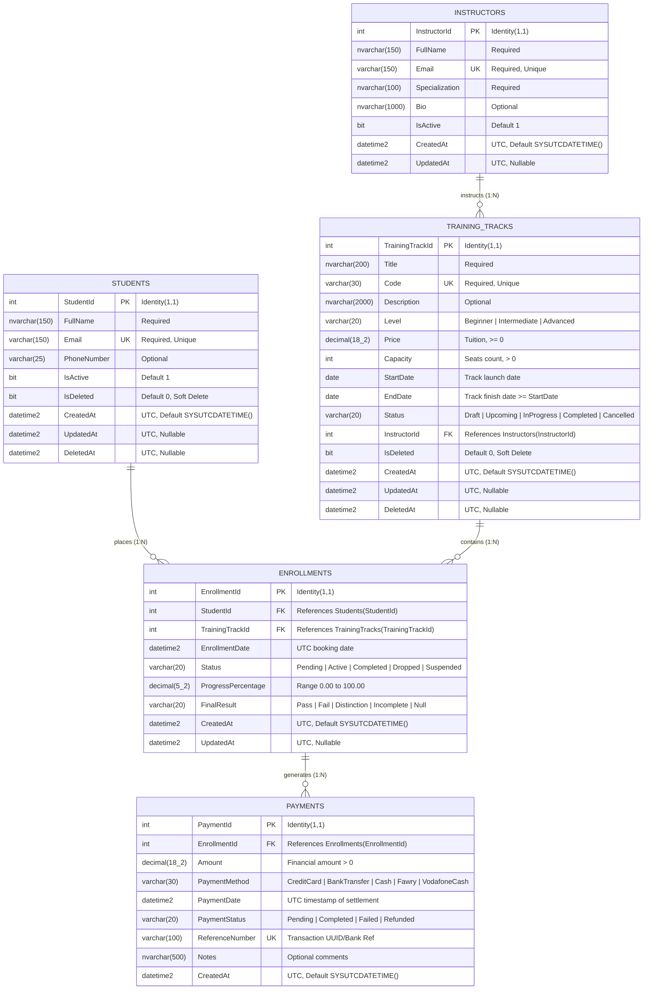
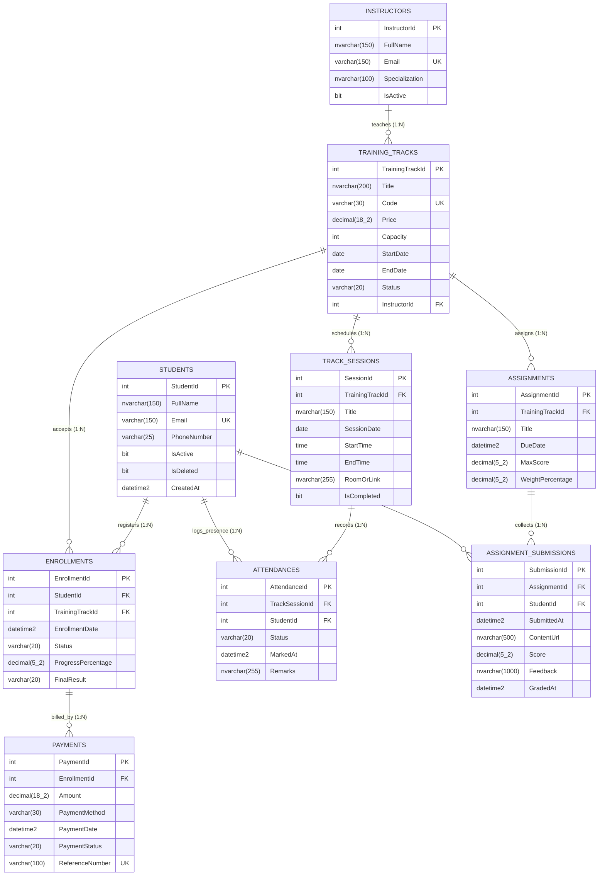

# Entity Relationship Diagram (ERD) Deliverable

> **Phase 03: Task 02 • Requirements to ERD**  
> **TechMaster Academy Database Architecture**

---

## 1. Core Domain ERD (Mermaid Notation)

---

## 2. Extended Domain ERD (Including Bonus Entities)

---

## 3. Cardinality & Crow's Foot Notation Explanation

| Notation Symbol | Symbol Meaning | Relationship Context |
| :---: | :--- | :--- |
| `||--o{` | **One-to-Many (Mandatory Parent, Optional Child)** | An `Instructor` can exist with zero `TrainingTracks` initially, but every `TrainingTrack` MUST have exactly one `Instructor`. |
| `||--o{` | **One-to-Many (Mandatory Parent, Optional Child)** | A `Student` may have 0 or more `Enrollments`. Each `Enrollment` MUST link to exactly one `Student`. |
| `||--o{` | **One-to-Many (Mandatory Parent, Optional Child)** | A `TrainingTrack` may have 0 or more `Enrollments`. Each `Enrollment` MUST link to exactly one `TrainingTrack`. |
| `||--o{` | **One-to-Many (Mandatory Parent, Optional Child)** | An `Enrollment` may have 0 or more `Payments` (installment payments). Each `Payment` belongs to exactly one `Enrollment`. |

---

## 4. Key Constraints and Indexing Matrix

| Table | Index Name | Type | Columns | Properties |
| :--- | :--- | :--- | :--- | :--- |
| `Students` | `PK_Students` | Clustered | `StudentId` | Primary Key |
| `Students` | `UQ_Students_Email` | Non-Clustered | `Email` | Filtered: `WHERE IsDeleted = 0` (Unique) |
| `Instructors` | `PK_Instructors` | Clustered | `InstructorId` | Primary Key |
| `Instructors` | `UQ_Instructors_Email` | Non-Clustered | `Email` | Unique |
| `TrainingTracks` | `PK_TrainingTracks` | Clustered | `TrainingTrackId` | Primary Key |
| `TrainingTracks` | `UQ_TrainingTracks_Code`| Non-Clustered | `Code` | Filtered: `WHERE IsDeleted = 0` (Unique) |
| `TrainingTracks` | `IX_TrainingTracks_InstructorId` | Non-Clustered | `InstructorId` | Foreign Key Performance Index |
| `Enrollments` | `PK_Enrollments` | Clustered | `EnrollmentId` | Primary Key |
| `Enrollments` | `UQ_Enrollments_Student_Track` | Non-Clustered | `StudentId, TrainingTrackId` | Unique (Prevents duplicate enrollment) |
| `Enrollments` | `IX_Enrollments_TrackId` | Non-Clustered | `TrainingTrackId` | Foreign Key / Lookup Performance Index |
| `Payments` | `PK_Payments` | Clustered | `PaymentId` | Primary Key |
| `Payments` | `UQ_Payments_ReferenceNumber` | Non-Clustered | `ReferenceNumber` | Unique (Idempotency / Gateway ref) |
| `Payments` | `IX_Payments_EnrollmentId` | Non-Clustered | `EnrollmentId` | Foreign Key / Ledger lookup |
