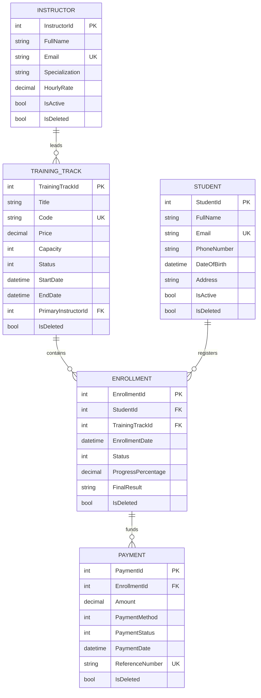

# Task 05 — Business Rules & Data Integrity

## 1. Overview & Purpose

Real enterprise backend systems protect the business from invalid data, inconsistent state transitions, and illegal actions. **Task 05** enforces strict business rules and data integrity directly in the service and domain layer rather than relying on "dumb CRUD" operations.

### Key Goals
1. **Business Correctness First**: Prevent invalid domain states before they ever reach the database.
2. **Clear & Actionable Errors**: Provide meaningful HTTP `400 Bad Request` or `409 Conflict` responses with detailed diagnostic messages.
3. **Data Lifecycle Protection**: Safeguard historical records using soft-delete query filters, prevent orphan records, and maintain accurate financial accounting.
4. **Verified Analytics**: Ensure revenue calculations and capacity reporting reflect true business transactions.

---

## 2. Business Rules Catalog

### A. Student Rules
- **Rule S1 (Unique Email)**: Case-insensitive email uniqueness check across all non-deleted students. Duplicate registration throws `400 Bad Request`.
- **Rule S2 (Required FullName)**: `FullName` is mandatory and cannot be empty or whitespace-only.
- **Rule S3 (Soft Delete Filter)**: Soft-deleted students (`IsDeleted = true`) are automatically filtered out from queries via EF Core Global Query Filters.
- **Rule S4 (Soft Delete Safeguard)**: Hard deletes are disabled by default. Deleting a student marks `IsDeleted = true` and updates audit metadata.
- **Rule S5 (Inactive Student Guard)**: Inactive (`IsActive = false`) or deleted students cannot receive new enrollments.

### B. Track Rules
- **Rule T1 (Unique Code)**: Track `Code` (e.g., `NET-BE-2026`) must be unique across the catalog.
- **Rule T2 (Required Title)**: Track `Title` is mandatory and cannot be empty.
- **Rule T3 (Strictly Positive Capacity)**: Track capacity must be greater than zero (`Capacity > 0`).
- **Rule T3b (Date Chronology)**: Track `StartDate` must precede `EndDate` (`StartDate < EndDate`).
- **Rule T4 (Active Instructor Required)**: Tracks must be assigned to an existing and active instructor (`IsActive = true`).
- **Rule T5 (Capacity Limit Enforcement)**: Enrollments are rejected if active/pending enrollments meet or exceed capacity.
- **Rule T6 (Track Status Enrollment Guard)**: Non-open tracks (`Closed`, `Completed`, `Archived`, `Draft`) reject new enrollments.

### C. Enrollment Rules
- **Rule E1 (Duplicate Prevention)**: A student cannot have duplicate `Active` or `Pending` enrollments in the same training track.
- **Rule E2 (Default Initial Status)**: New enrollments are created in `Pending` status by default.
- **Rule E3 (Auto-Activation on Payment)**: Recording a successful `Completed` payment automatically promotes a `Pending` enrollment to `Active`.
- **Rule E4 (Completed Lifecycle Guard)**: `Completed` enrollments cannot be transitioned to `Cancelled`.
- **Rule E5 (Capacity Calculation)**: `Cancelled` enrollments do **not** consume track capacity.

### D. Payment & Financial Rules
- **Rule P1 (Positive Payment Amount)**: Payment amount must be strictly greater than zero (`Amount > 0`).
- **Rule P2 (Overpayment Rejection)**: Payments exceeding the remaining tuition balance (`Amount > (Track.Price - Sum(CompletedPayments))`) are rejected with `400 Bad Request`.
- **Rule P3 (Valid Payment Method)**: Payment method must be a valid defined enum (`CreditCard`, `BankTransfer`, `Cash`, `Fawry`, `VodafoneCash`).
- **Rule P4 (Realized Revenue Definition)**: Only payments with status `Completed` count towards realized revenue.
- **Rule P5 (Failed Payment Non-Activation)**: `Failed` or `Refunded` payments do not activate enrollments or reduce outstanding balance.
- **Rule P6 (Cancelled Enrollment Payment Block)**: Payments cannot be added to `Cancelled` enrollments.

---

## 3. System Architecture & Relational Schema



---

## 4. API Endpoints Reference

### Students (`/api/students`)
| Method | Endpoint | Description |
| :--- | :--- | :--- |
| `GET` | `/api/students` | Get paginated and filtered list of active students |
| `GET` | `/api/students/{id}` | Get student details by ID |
| `POST` | `/api/students` | Register student (validates unique email and required fields) |
| `PUT` | `/api/students/{id}` | Update student profile |
| `DELETE` | `/api/students/{id}` | Soft-delete student (`IsDeleted = true`) |

### Instructors (`/api/instructors`)
| Method | Endpoint | Description |
| :--- | :--- | :--- |
| `GET` | `/api/instructors` | Get instructors list |
| `GET` | `/api/instructors/{id}` | Get instructor details |
| `POST` | `/api/instructors` | Create instructor profile |
| `PUT` | `/api/instructors/{id}` | Update instructor profile |
| `DELETE` | `/api/instructors/{id}` | Delete instructor (prevents orphan track references) |

### Training Tracks (`/api/tracks`)
| Method | Endpoint | Description |
| :--- | :--- | :--- |
| `GET` | `/api/tracks` | Get tracks list with capacity metrics |
| `GET` | `/api/tracks/{id}` | Get track details |
| `POST` | `/api/tracks` | Create track (validates code, capacity > 0, dates, active instructor) |
| `PUT` | `/api/tracks/{id}` | Update track |
| `DELETE` | `/api/tracks/{id}` | Delete track |

### Enrollments (`/api/enrollments`)
| Method | Endpoint | Description |
| :--- | :--- | :--- |
| `GET` | `/api/enrollments` | Get enrollments list |
| `GET` | `/api/enrollments/{id}` | Get enrollment details with payments history |
| `POST` | `/api/enrollments` | Create enrollment (enforces capacity, duplicate check, status check) |
| `PATCH` | `/api/enrollments/{id}/status` | Update status (blocks cancelling completed records) |
| `DELETE` | `/api/enrollments/{id}` | Soft-delete enrollment |

### Payments (`/api/payments`)
| Method | Endpoint | Description |
| :--- | :--- | :--- |
| `GET` | `/api/payments` | Get payments list |
| `GET` | `/api/payments/{id}` | Get payment details |
| `POST` | `/api/payments` | Record payment (rejects overpayment, <= 0, and cancelled enrollments) |
| `PATCH` | `/api/payments/{id}/status` | Update payment status |

### Integrity & Analytics Reports (`/api/reports`)
| Method | Endpoint | Description |
| :--- | :--- | :--- |
| `GET` | `/api/reports/revenue-summary` | Overall financial totals (completed payments only) |
| `GET` | `/api/reports/revenue-by-track` | Revenue and collection rate breakdown by track |
| `GET` | `/api/reports/top-tracks` | Top tracks ranked by active enrollment & capacity utilization |
| `GET` | `/api/reports/instructor-workload` | Instructor supervision and revenue stats |
| `GET` | `/api/reports/students-without-payments` | Enrollments with zero completed payments |
| `GET` | `/api/reports/dashboard-summary` | Executive dashboard summary |
| `GET` | `/api/reports/track-capacities` | Real-time seat occupancy and remaining capacity |

---

## 5. How to Run & Verify

### 1. Build and Run the API
```bash
# Build project
dotnet build phase-03-real-backend-data-systems/task-05-business-rules-data-integrity/TrainingCenter.Api/TrainingCenter.Api.csproj

# Run API server (Default: http://127.0.0.1:5090)
dotnet run --project phase-03-real-backend-data-systems/task-05-business-rules-data-integrity/TrainingCenter.Api/TrainingCenter.Api.csproj --urls=http://127.0.0.1:5090
```

### 2. Swagger UI
Navigate to `http://localhost:5090/` in your browser to interact with all documented endpoints and test payload schemas.

### 3. Automated Postman & PowerShell Verification
Run the included verification suite:
```powershell
powershell -ExecutionPolicy Bypass -File scratch/test_task05.ps1
```
Or import the Postman collection and environment located in `postman/`:
- `postman/TechMaster_Business_Rules_API.postman_collection.json`
- `postman/TechMaster_Task05_Environment.postman_environment.json`
