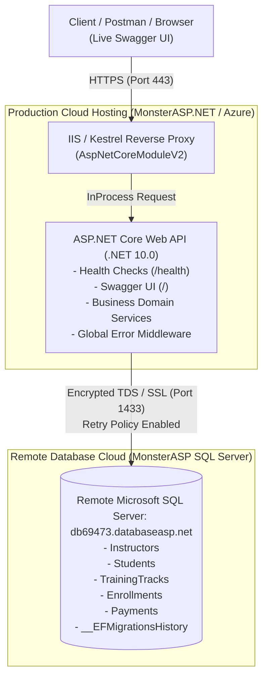

# Task 06 — Production Hosting & Remote Database

## 1. Overview & Purpose

**Task 06** transitions the **Phase 03 Training Center Backend** from a local-only development setup into a real, publicly accessible cloud-hosted API connected to a remote Microsoft SQL Server database.

In real-world backend engineering, local development is only the first step. Delivering a production-grade system requires:
1. **Public Cloud Hosting**: Deploying the ASP.NET Core Web API on a live host (MonsterASP.NET, Azure App Service, or equivalent).
2. **Remote SQL Server Connectivity**: Provisioning and connecting the API to a remote relational database instance.
3. **Safe Secret Configuration**: Storing connection strings and credentials securely via environment variables and host configuration panels—never hardcoded in Git.
4. **Automated Schema Deployment**: Applying EF Core migrations safely upon startup (`MigrateAsync()`) or EF CLI.
5. **Live Verification**: Proving end-to-end functionality (read, write, business rule protection) on the live production endpoint.

---

## 2. System Architecture & Cloud Infrastructure



---

## 3. The 6-Step Deployment Lifecycle

```
┌─────────────────────────────────────────────────────────────────────────────────┐
│                          TASK 06 DEPLOYMENT LIFECYCLE                           │
├─────────────────┬─────────────────┬──────────────────┬──────────────────────────┤
│ Step 01: Local  │ Step 02: Host   │ Step 03: Remote  │ Step 04: Apply           │
│ First & Code    │ App Creation    │ SQL Server Setup │ Schema Migrations        │
├─────────────────┼─────────────────┼──────────────────┼──────────────────────────┤
│ Step 05: Publish│ Step 06: Safety │ Step 07: Live    │ Step 08: Evidence        │
│ API to Cloud    │ & Secrets Audit │ Endpoint Proof   │ Documentation            │
└─────────────────┴─────────────────┴──────────────────┴──────────────────────────┘
```

---

### Step 01 — Local First
Before cloud deployment, verify the entire solution locally:
1. Clean build of the project:
   ```bash
   dotnet build phase-03-real-backend-data-systems/task-06-production-hosting-remote-database/TrainingCenter.Api/TrainingCenter.Api.csproj
   ```
2. Generate EF Core migration baseline:
   ```bash
   dotnet ef migrations add InitialProductionSchema --project phase-03-real-backend-data-systems/task-06-production-hosting-remote-database/TrainingCenter.Api/TrainingCenter.Api.csproj
   ```

---

### Step 02 — Create Remote Hosting App

#### Recommended Provider: MonsterASP.NET
1. Register/Log in to [MonsterASP.NET](https://www.monsterasp.net/).
2. Create a new website/app with ASP.NET Core support.
3. Choose the appropriate runtime version (.NET 10.0 or publish as self-contained).
4. Enable **HTTPS (SSL Certificate)** in the domain settings.
5. Record your live site URL (e.g., `https://[your-app-name].monsterasp.net`).

---

### Step 03 — Create Remote SQL Database & Safe Configuration

1. **Create Database**: Create a new SQL Server database in your hosting portal (MonsterASP.NET MS SQL Server: `db69473.databaseasp.net`).
2. **User Credentials**: Create a dedicated database user with `db_owner` permissions.
3. **Connection String**:
   - Host: `db69473.databaseasp.net`
   - Database: `db69473`
   - User: `db69473`
   - Connection format:
     ```text
     Server=db69473.databaseasp.net; Database=db69473; User Id=db69473; Password=******; Encrypt=False; MultipleActiveResultSets=True; TrustServerCertificate=True;
     ```
4. **Safe Secret Management**:
   - Set the connection string in the MonsterASP **Environment Settings** or **Connection Strings** panel (`ConnectionStrings__DefaultConnection`).
   - [`appsettings.Production.json`](TrainingCenter.Api/appsettings.Production.json) in source control contains sanitized placeholders for public repository safety.

---

### Step 04 — Apply Migrations to Remote Database

#### Migration Execution Methods:
- **Method A (Automated at Startup inside MonsterASP)**: When the API boots up inside MonsterASP hosting, `Program.cs` executes:
  ```csharp
  await context.Database.MigrateAsync();
  await DbInitializer.SeedAsync(context);
  ```
  This connects to `db69473.databaseasp.net` within the host's internal network, creates all tables, and seeds initial data automatically.
- **Method B (Remote EF CLI)**: Apply migrations from remote connection if external port 1433 is opened:
  ```bash
  dotnet ef database update --connection "Server=db69473.databaseasp.net;Database=db69473;User Id=db69473;Password=YOUR_PASSWORD;Encrypt=False;MultipleActiveResultSets=True;TrustServerCertificate=True;" --project phase-03-real-backend-data-systems/task-06-production-hosting-remote-database/TrainingCenter.Api/TrainingCenter.Api.csproj
  ```

---

### Step 05 — Publish API

#### Publish Command:
```powershell
dotnet publish phase-03-real-backend-data-systems/task-06-production-hosting-remote-database/TrainingCenter.Api/TrainingCenter.Api.csproj -c Release -o ./publish
```

#### Deploying Files:
- Upload the contents of the `publish/` folder to the remote host root (`site/wwwroot/` for MonsterASP).
- Ensure [`web.config`](TrainingCenter.Api/web.config) is present at the root.

#### Live Verification Checklist:
- [x] **Live Swagger UI**: Navigate to `https://[your-app].monsterasp.net/` (served directly at root `/`).
- [x] **Health Check**: `GET /health` returns `200 OK` with `DatabaseConnected: true`.
- [x] **Read from Remote DB (GET)**: `GET /api/reports/dashboard-summary` returns live statistics from remote SQL Server.
- [x] **Write to Remote DB (POST)**: `POST /api/students` creates a new persistent student in remote SQL Server.
- [x] **Business Rule Enforcement**: `POST /api/payments` rejects overpayment with `400 Bad Request`.

---

### Step 06 — Production Safety Check

- [x] **No Hardcoded Passwords**: Audited `appsettings.json` and `appsettings.Production.json`.
- [x] **Credential Masking**: All screenshots and documentation hide connection secrets.
- [x] **Resilient Database Configuration**: `EnableRetryOnFailure(5)` configured in EF Core to handle transient cloud disconnects.
- [x] **Self-Contained Ready**: Published artifacts can run self-contained if cloud host runtime is older than build runtime.

---

## 4. Key Endpoints Reference

| Endpoint | Method | Purpose | Production Verification |
| :--- | :---: | :--- | :--- |
| `/` | `GET` | Live Swagger UI | Confirms OpenAPI documentation is live online |
| `/health` | `GET` | Remote DB Health Check | Confirms SQL Server connectivity and provider |
| `/api/tracks` | `GET` | Read Catalog | Queries remote `[TrainingTracks]` |
| `/api/students` | `GET` | Read Students | Paginated query with soft-delete filter |
| `/api/students` | `POST` | Register Student | Writes new row to remote `[Students]` table |
| `/api/enrollments` | `POST` | Create Enrollment | Enforces capacity guard and duplicate checks |
| `/api/payments` | `POST` | Record Payment | Enforces balance check and activates enrollment |
| `/api/reports/dashboard-summary` | `GET` | Financial Dashboard | Computes live revenue and enrollment metrics |

---

## 5. Troubleshooting Common Hosting Pitfalls

### 1. HTTP 500.19 / 502.5 Startup Errors on IIS / MonsterASP
- **Cause**: Missing `web.config` or incompatible .NET runtime on host.
- **Solution**: Set `stdoutLogEnabled="true"` in `web.config` to check `logs/stdout_*.log`. If host lacks .NET 10 runtime, publish as self-contained:
  ```powershell
  dotnet publish -c Release -r win-x64 --self-contained true -o ./publish
  ```

### 2. SQL Server SSL / Certificate Error
- **Error**: *“A connection was successfully established with the server, but then an error occurred during the login process. (provider: SSL Provider, error: 0 - The certificate chain was issued by an authority that is not trusted.)”*
- **Solution**: Append `TrustServerCertificate=True;Encrypt=False;` to your connection string.

### 3. Swagger Returns 404 in Production
- **Cause**: By default, ASP.NET Core templates wrap `app.UseSwagger()` inside `if (app.Environment.IsDevelopment())`.
- **Solution**: In `Program.cs`, `app.UseSwagger()` and `app.UseSwaggerUI()` are enabled unconditionally so Swagger is always accessible on your live domain.

---

## 6. Deliverables & Artifacts Index

- **Source Code**: [`TrainingCenter.Api/`](TrainingCenter.Api/)
- **EF Core Migrations**: [`TrainingCenter.Api/Migrations/`](TrainingCenter.Api/Migrations/)
- **Postman Test Suite**: [`postman/TechMaster_Task06_Production_API.postman_collection.json`](postman/TechMaster_Task06_Production_API.postman_collection.json)
- **Postman Environments**:
  - [`postman/TechMaster_Task06_Local_Environment.postman_environment.json`](postman/TechMaster_Task06_Local_Environment.postman_environment.json)
  - [`postman/TechMaster_Task06_Production_Environment.postman_environment.json`](postman/TechMaster_Task06_Production_Environment.postman_environment.json)
- **Full Evidence Matrix**: [`evidence/README.md`](evidence/README.md)
