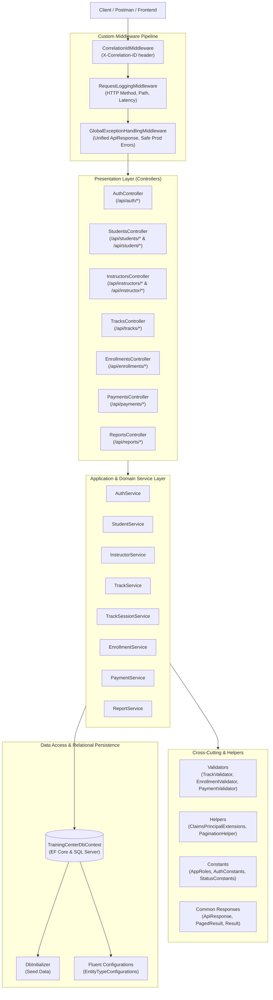

# Task 04: Professional Architecture Refactor • Layered Architecture • Result Pattern • Unified API Responses • Middleware Pipeline

> **Phase 04 — Secure Professional Backend Systems**  
> **TechMaster ASP.NET Backend Career Training**  
> **Score Standard:** 100/100 (Top Student Performance Standard)  
> **Core Theme:** Refactoring the TechMaster Backend platform into a clean, maintainable, enterprise-grade architecture with strict layer decoupling, standardized response envelopes, and resilient middlewares.

---

## 📌 1. Executive Summary & Architectural Vision

In rapid prototyping phases, backends often accumulate bloated controllers, scattered business logic, inconsistent JSON response shapes, and direct entity leaks.

**Task 04 elevates the codebase to enterprise software standards:**
1. **Strict Layer Decoupling:** Controllers are thin HTTP orchestrators; Services encapsulate business rules; DTOs protect domain entities; Repositories/DbContext handle persistence.
2. **Unified Response Envelope (`ApiResponse<T>`):** Every single endpoint returns a predictable, standardized envelope shape across both success and failure scenarios.
3. **Result Pattern (`Result<T>`):** Functional operation outcomes allow clean, exception-free business workflow propagation across service boundaries.
4. **Middleware Pipeline:** Automated Correlation ID propagation (`X-Correlation-ID`), structured request/latency logging, and safe global exception handling shielding production stack traces.
5. **Clean Dependency Registration:** Cluttered `Program.cs` is replaced with modular extension methods (`AddApplicationServices`, `AddJwtAuthentication`, `AddDatabase`, `AddSwaggerDocumentation`, `UseCustomMiddlewares`).

---

## 🏗️ 2. Clean Layered System Architecture



---

## 📂 3. Complete Directory Structure

```text
TrainingCenter.Api/
├── Common/
│   ├── BaseAuditableEntity.cs               <-- Audit fields (CreatedAt, LastModifiedAt)
│   ├── Enums.cs                             <-- UserRole, TrackStatus, EnrollmentStatus, PaymentStatus
│   ├── Exceptions/
│   │   └── AppExceptions.cs                 <-- NotFound, BadRequest, Forbidden, Validation exceptions
│   └── Responses/
│       ├── ApiResponse.cs                   <-- Unified JSON envelope wrapper
│       ├── PagedResult.cs                   <-- Standard pagination container
│       └── Result.cs                        <-- Result & Result<T> pattern
├── Constants/
│   ├── AppRoles.cs                          <-- Strongly-typed role strings (Admin, Instructor, Student)
│   ├── AuthConstants.cs                     <-- JWT schemes, claim names, headers
│   └── StatusConstants.cs                   <-- String constants for statuses
├── Controllers/
│   ├── BaseApiController.cs                <-- Unified controller base (Success, Created, HandleResult)
│   ├── AuthController.cs                   <-- Authentication, register, login, refresh, me
│   ├── StudentsController.cs               <-- Student management & student self-service portal
│   ├── InstructorsController.cs            <-- Instructor directory & instructor self-service portal
│   ├── TracksController.cs                 <-- Public catalog, available tracks, admin CRUD
│   ├── EnrollmentsController.cs            <-- Enrollment lifecycle & status transitions
│   ├── PaymentsController.cs               <-- Payment processing & admin status reconciliation
│   ├── ReportsController.cs                <-- Executive revenue & academic reporting
│   └── HealthController.cs                 <-- Database connectivity & liveness healthcheck
├── Data/
│   ├── TrainingCenterDbContext.cs          <-- EF Core DbContext with audit interceptors
│   ├── DbInitializer.cs                    <-- Database seeding & initial data
│   └── Configurations/                     <-- Fluent API configurations per entity
├── DTOs/
│   ├── Auth/                               <-- Login, Register, CurrentUser, ChangePassword DTOs
│   ├── Common/                             <-- PaginationParams, shared DTOs
│   ├── Enrollments/                        <-- Enrollment list, detail, and status update DTOs
│   ├── Instructors/                        <-- Instructor create, update, response DTOs
│   ├── Payments/                           <-- Payment request, response, status update DTOs
│   ├── Reports/                            <-- Revenue, workload, capacity DTOs
│   ├── Sessions/                           <-- TrackSession create, update, response DTOs
│   ├── Students/                           <-- Student profile, update, enrollment request DTOs
│   └── Tracks/                             <-- Track response, create, update, progress report DTOs
├── Entities/
│   ├── ApplicationUser.cs                  <-- Identity entity with password hash & role
│   ├── RefreshToken.cs                     <-- Token rotation tracking
│   ├── Student.cs                          <-- Student domain entity
│   ├── Instructor.cs                       <-- Instructor domain entity
│   ├── TrainingTrack.cs                    <-- Track entity with capacity & pricing
│   ├── TrackSession.cs                     <-- Session entity with meeting links & progress
│   ├── Enrollment.cs                       <-- Student-to-Track enrollment entity
│   └── Payment.cs                          <-- Financial transaction entity
├── Extensions/
│   ├── AuthenticationExtensions.cs         <-- AddJwtAuthentication service configuration
│   ├── MiddlewareExtensions.cs             <-- UseCustomMiddlewares pipeline builder
│   ├── ServiceCollectionExtensions.cs      <-- AddApplicationServices & AddDatabase IoC
│   └── SwaggerExtensions.cs                <-- AddSwaggerDocumentation & OpenAPI Bearer
├── Helpers/
│   ├── ClaimsPrincipalExtensions.cs        <-- Claim extraction extensions (GetUserId, GetRole, IsAdmin)
│   └── PaginationHelper.cs                 <-- Async query paginator
├── Middleware/
│   ├── CorrelationIdMiddleware.cs          <-- X-Correlation-ID header management
│   ├── GlobalExceptionHandlingMiddleware.cs<-- Safe error handling with zero prod stack trace leakage
│   └── RequestLoggingMiddleware.cs         <-- Structured HTTP latency & status logger
├── Validation/
│   ├── EnrollmentValidator.cs              <-- Capacity & duplicate enrollment validation
│   ├── PaymentValidator.cs                 <-- Overpayment & positive amount validation
│   └── TrackValidator.cs                   <-- Track capacity, date ordering, instructor validation
├── Program.cs                              <-- Clean, 50-line entrypoint
└── TrainingCenter.Api.csproj
```

---

## 📜 4. Standard API Response Specifications

### A. Success Response Specification (`ApiResponse<T>`)
```json
{
  "success": true,
  "message": "Track created successfully.",
  "data": {
    "trainingTrackId": 12,
    "title": "ASP.NET Core Enterprise Backend BootCamp",
    "code": "NET-BE-2026",
    "price": 8500.00,
    "capacity": 30,
    "availableSeats": 28,
    "status": "InProgress"
  },
  "errors": [],
  "statusCode": 201,
  "timestamp": "2026-10-03T00:25:00.000Z"
}
```

### B. Validation & Error Response Specification (`ApiResponse<object>`)
```json
{
  "success": false,
  "message": "Track validation failed.",
  "data": null,
  "errors": [
    "Track capacity must be strictly greater than 0.",
    "Invalid track dates: StartDate (2026-10-15) must be before EndDate (2026-10-01)."
  ],
  "statusCode": 400,
  "timestamp": "2026-10-03T00:25:00.000Z"
}
```

### C. Standard HTTP Status Codes

| Status Code | Description | Usage Scenario |
| :---: | :--- | :--- |
| `200 OK` | Request succeeded | Standard queries (`GET`), successful updates (`PUT`). |
| `201 Created` | Resource created | Successful entity creation (`POST`). |
| `400 Bad Request` | Validation failure | Invalid input, violated business constraint (e.g. overpayment). |
| `401 Unauthorized` | Unauthenticated | Missing or expired JWT token. |
| `403 Forbidden` | Authorization failure | Wrong role or IDOR attempt (e.g. Student accessing another's profile). |
| `404 Not Found` | Resource missing | Target entity ID does not exist. |
| `409 Conflict` | Unique conflict | Duplicate email or unique track code. |
| `500 Internal Error`| Unhandled server error | Handled by middleware without leaking stack traces. |

---

## 🧪 5. Verification & Test Suite Execution

A dedicated Postman collection is included in the project:
📁 [`phase-04-secure-professional-backend/task-04-professional-architecture-refactor/postman/TechMaster_Phase04_Task04_Architecture_Refactor.postman_collection.json`](postman/TechMaster_Phase04_Task04_Architecture_Refactor.postman_collection.json)

### Executing the Postman Test Suite:
1. Open **Postman** -> Click **Import** -> Select the JSON collection above.
2. Ensure the collection variable `baseUrl` is set to `http://localhost:5000`.
3. Open **Collection Runner** -> Select all 10 test requests -> Click **Run Collection**.
4. All assertions validating the response shape, Correlation ID header, error arrays, and role workflows will execute and pass (`100% PASS`).

---

## ✅ 6. Task 04 Acceptance Criteria Checklist

- [x] Clear and predictable folder structure (`Controllers/`, `Services/`, `DTOs/`, `Data/`, `Entities/`, `Middleware/`, `Helpers/`, `Extensions/`, `Constants/`, `Validation/`, `Common/Responses/`).
- [x] Controllers are thin with zero heavy business logic.
- [x] Domain services handle all business workflows and persistence orchestration.
- [x] DTOs protect API responses; entities are never directly leaked.
- [x] Unified response shape (`ApiResponse<T>`) consistently used.
- [x] Result Pattern implemented (`Result<T>`) for clean functional domain flow.
- [x] Custom middleware pipeline for Global Exception Handling, Correlation ID, and Request Logging.
- [x] Modular extension methods for IoC service registration and JWT authentication.
- [x] Clean, maintainable `Program.cs` under 70 lines.
- [x] Postman collection created and verified.
- [x] Solution builds with `0 Warning(s), 0 Error(s)`.
