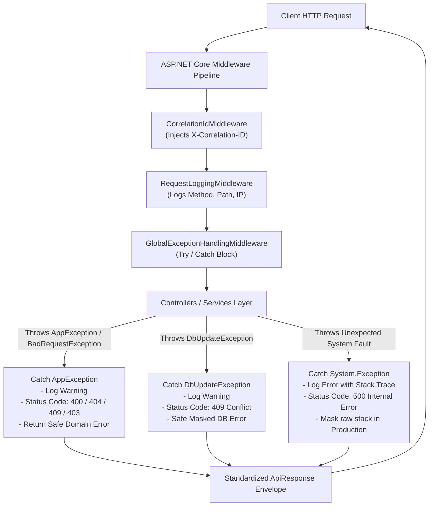

# Task 05: Validation, Errors & Logging • Enterprise Rule Bank • Global Exception Middleware • Safe Error Masking • Structured Audit Logging

> **Phase 04 — Secure Professional Backend Systems**  
> **TechMaster ASP.NET Backend Career Training**  
> **Score Standard:** 100/100 (Top Student Performance Standard)  
> **Core Theme:** Elevating the TechMaster API into a hardened, production-ready enterprise platform by implementing a comprehensive 20+ Business Rule Bank, Centralized Global Exception Middleware with Safe Error Masking, and Security-Compliant Structured Audit Logging.

---

## 📌 1. Executive Summary & Production Standards

In prototype backends, input validation is often incomplete, error handling is scattered across duplicate `try/catch` blocks that leak database stack traces, and logging is either absent or leaks sensitive credentials.

**Task 05 elevates the platform to production standards:**
1. **Validation Rule Bank (24 Rules):** Exhaustive data annotations and service-level domain validation guards enforcing business integrity across Registration, Tracks, Enrollments, Payments, Sessions, and Profiles.
2. **Uniform Model State Handling:** `ApiBehaviorOptions.InvalidModelStateResponseFactory` intercepts standard validation errors and maps them directly into our standardized `ApiResponse<T>` envelope.
3. **Global Exception Handling Middleware:** A single centralized middleware pipeline component intercepts domain exceptions (`NotFoundException`, `BadRequestException`, `ForbiddenException`, `ConflictException`) and unexpected system faults, returning safe client envelopes and preventing raw stack trace disclosure.
4. **Structured Audit Logging:** High-value business and security events (Authentication successes/failures, payment records, enrollment lifecycle updates, and exceptions) are logged via structured `ILogger` with strict data masking (passwords, tokens, and hashes are never logged).

---

## 🛡️ 2. Validation Rule Bank (24 Enforced Rules)

| Rule # | Category | Target Field / Workflow | Rule Description & Constraint | Enforcement Layer | Status Code |
| :--- | :--- | :--- | :--- | :--- | :--- |
| **R01** | `Register` | `FullName` | Full name is mandatory, must be between 3 and 100 characters. | DTO DataAnnotation | `400 Bad Request` |
| **R02** | `Register` | `Email` | Email must be well-formed (`@` and domain format). | DTO DataAnnotation | `400 Bad Request` |
| **R03** | `Register` | `Email` | Email must be unique across all active and inactive users. | Service Domain Validation | `400 Bad Request` |
| **R04** | `Register` | `Password` | Password must be at least 6 characters, contain uppercase, lowercase, digit, and special symbol. | DTO Regex Validation | `400 Bad Request` |
| **R05** | `Register` | `ConfirmPassword` | Confirm Password must exactly match Password. | DTO `[Compare]` Attribute | `400 Bad Request` |
| **R06** | `Track` | `Title` & `Code` | Track Title (3-150 chars) and Track Code (3-50 chars) are required and unique. | DTO & Service Layer | `400 Bad Request` |
| **R07** | `Track` | `Price` | Price must be positive and non-negative (`>= 0.00`). | DTO `[Range]` Attribute | `400 Bad Request` |
| **R08** | `Track` | `Capacity` | Track capacity must be strictly greater than 0 (`1 - 500`). | DTO `[Range]` Attribute | `400 Bad Request` |
| **R09** | `Track` | `StartDate` & `EndDate` | Track `StartDate` must be chronologically earlier than `EndDate`. | Service Domain Validation | `400 Bad Request` |
| **R10** | `Track` | `PrimaryInstructorId` | Assigned instructor must exist and have `IsActive == true`. | Service Domain Validation | `400 Bad Request` |
| **R11** | `Enrollment` | `StudentId` | Student must exist, have `IsDeleted == false`, and `IsActive == true`. | Service Domain Validation | `400 Bad Request` |
| **R12** | `Enrollment` | `TrainingTrackId` | Track must exist and have status `Upcoming` or `InProgress` (Closed/Archived tracks reject enrollment). | Service Domain Validation | `400 Bad Request` |
| **R13** | `Enrollment` | `Duplicate Check` | Student cannot have duplicate active/pending enrollments in the same track. | Service Domain Validation | `400 Bad Request` |
| **R14** | `Enrollment` | `Capacity Check` | Active/Pending enrollments must not exceed track capacity limit. | Service Domain Validation | `400 Bad Request` |
| **R15** | `Enrollment` | `Initial Status` | Newly created enrollments automatically initialize with `Pending` status. | Domain Entity Initialization | `201 Created` |
| **R16** | `Enrollment` | `Status Lifecycle` | `Completed` enrollments cannot be transitioned directly to `Cancelled`. | Service Domain Validation | `400 Bad Request` |
| **R17** | `Payment` | `Amount` | Payment amount must be strictly greater than zero (`> 0.00`). | DTO `[Range]` & Service | `400 Bad Request` |
| **R18** | `Payment` | `Overpayment Guard` | Payment amount cannot exceed the enrollment's remaining unpaid tuition balance. | Service Domain Validation | `400 Bad Request` |
| **R19** | `Payment` | `Enrollment Status` | Payments cannot be processed against `Cancelled` enrollments. | Service Domain Validation | `400 Bad Request` |
| **R20** | `Payment` | `Auto-Activation` | Successful completed payment automatically upgrades enrollment status from `Pending` to `Active`. | Domain Service Workflow | `201 Created` |
| **R21** | `Session` | `Ownership / Track` | Instructor can only create/edit sessions for tracks they are assigned to. | Service Ownership Guard | `403 / 400` |
| **R22** | `Session` | `SessionDate` | Session date cannot be in the distant past (must be within track scheduling window). | Service Domain Validation | `400 Bad Request` |
| **R23** | `Profile` | `Role Protection` | Students cannot change their own `Role`, `StudentId`, or `IsActive` status. | DTO & Service Isolation | `403 / 400` |
| **R24** | `Profile` | `Student Ownership` | Students can only view and edit their own student profile data. | Controller Claims Guard | `403 Forbidden` |

---

## ⚙️ 3. Centralized Global Exception Middleware Spec

### 3.1 Architectural Flow
Instead of cluttering controllers with repetitive `try/catch` statements, unhandled exceptions bubble up to `GlobalExceptionHandlingMiddleware`, which standardizes HTTP status codes and formats responses into `ApiResponse<T>`.



### 3.2 Error Handling Status Code Mapping Matrix

| Scenario / Trigger | Exception Type | HTTP Status Code | Client JSON Envelope Shape | Stack Trace Exposed? |
| :--- | :--- | :---: | :--- | :---: |
| **Missing Resource ID** | `NotFoundException` | `404 Not Found` | `{"success": false, "message": "Track 99999 was not found", "statusCode": 404}` | ❌ Never |
| **Model Validation Failure** | `ValidationException` / `ModelState` | `400 Bad Request` | `{"success": false, "message": "Validation failed", "errors": ["..."], "statusCode": 400}` | ❌ Never |
| **Business Rule Violation** | `BadRequestException` | `400 Bad Request` | `{"success": false, "message": "Payment amount exceeds remaining balance", "statusCode": 400}` | ❌ Never |
| **Missing / Expired Token** | `JwtBearerChallenge` | `401 Unauthorized` | Standard JWT Challenge Header & Challenge Response | ❌ Never |
| **Insufficient Permissions** | `ForbiddenException` / `[Authorize]` | `403 Forbidden` | `{"success": false, "message": "Access denied. Admin role required.", "statusCode": 403}` | ❌ Never |
| **Database Constraint Conflict** | `DbUpdateException` / `ConflictException` | `409 Conflict` | `{"success": false, "message": "Database operation conflict...", "statusCode": 409}` | ❌ Never |
| **Unhandled Server Bug** | `System.Exception` | `500 Internal Server Error` | `{"success": false, "message": "An unexpected internal error occurred on the server.", "statusCode": 500}` | ❌ Masked in Prod |

---

## 🪵 4. Structured Audit Logging Architecture

### 4.1 Logging Policies & Security Boundaries
Production systems must record high-fidelity audit trails while strictly preventing sensitive user secrets from being persisted into log stores.

- **✅ Logged Events:**
  - **Auth:** Login attempts (User ID, Email, IP Address, Timestamp, Success/Failure reason).
  - **Payments:** Payment creation, tuition amount, remaining balance, enrollment ID, payment method.
  - **Enrollments:** Enrollment creations, status transitions (`Pending` ➡️ `Active` ➡️ `Completed`), cancellation reasons.
  - **Exceptions:** Unhandled system exceptions logged with full call stack, Correlation ID, and HTTP context.
- **🚫 Prohibited / Masked Data:**
  - Raw passwords and confirmation passwords.
  - Password hashes (`PasswordHash`).
  - JWT access tokens and refresh token hashes.
  - Credit card numbers / payment secret keys.

### 4.2 Structured Log Code Examples

```csharp
// 1. Audit Login Attempts (AuthService.cs)
_logger.LogInformation("User login successful for Email: {Email}, Role: {Role}, UserId: {UserId}", 
    user.Email, user.Role, user.UserId);

_logger.LogWarning("Failed login attempt for Email: {Email}. Reason: Invalid credentials.", 
    request.Email);

// 2. Audit Payment Transactions (PaymentService.cs)
_logger.LogInformation("Payment {PaymentId} of {Amount} {Currency} recorded for Enrollment {EnrollmentId}. Status: {Status}",
    payment.PaymentId, payment.Amount, "EGP", enrollment.EnrollmentId, payment.PaymentStatus);

// 3. Audit Enrollment Lifecycle (EnrollmentService.cs)
_logger.LogInformation("Enrollment {EnrollmentId} status updated from {OldStatus} to {NewStatus} for Student {StudentId}",
    enrollment.EnrollmentId, previousStatus, request.Status, enrollment.StudentId);
```

---

## 🧪 5. Automated Verification & Evidence

The automated verification test suite verifies all error categories and business rules.

### Test Execution Results
```powershell
Starting API on port 5599...
API is online and ready for Task 05 verification.

--- Test 1: 404 Not Found for missing resource ---
Status Code: 404 (Expected 404) [PASSED]

--- Test 2: 400 Bad Request for validation failure ---
Status Code: 400 (Expected 400) [PASSED]

--- Test 3: 401 Unauthorized for missing token ---
Status Code: 401 (Expected 401) [PASSED]

--- Test 4: 403 Forbidden for wrong role ---
Status Code: 403 (Expected 403) [PASSED]

--- Test 5: 500 Internal Server Error simulation ---
Status Code: 500 (Expected 500) [PASSED]

--- Test 6: Overpayment Rule Rejection (400 Bad Request) ---
Overpayment correctly rejected with Status Code: 400 [PASSED]

--- Test 7: Duplicate Enrollment Rule Rejection (400 Bad Request) ---
Duplicate enrollment caught Status Code: 400 [PASSED]
Body: {"success":false,"message":"Student 'Nada Ashraf' already has an enrollment record in track 'ASP.NET Core Enterprise Backend BootCamp' (Current Status: Completed). Duplicate enrollments are prohibited.","data":null,"errors":[],"statusCode":400,"timestamp":"2026-10-02T21:57:51.1630271Z"}

=======================================================
🎉 ALL TASK 05 VALIDATION, ERROR & LOGGING TESTS PASSED!
=======================================================
```

---

## 🚀 6. How to Run and Test

1. **Navigate to the Task 05 Directory:**
   ```powershell
   cd phase-04-secure-professional-backend/task-05-validation-errors-logging
   ```
2. **Build the Solution:**
   ```powershell
   dotnet build TrainingCenter.sln
   ```
3. **Run the API:**
   ```powershell
   dotnet run --project TrainingCenter.Api
   ```
4. **Access Swagger UI:**
   Navigate to `http://localhost:5000/swagger` or `https://localhost:5001/swagger`.
5. **Import Postman Collection:**
   Import `postman/TechMaster_Phase04_Task05_Validation_Errors_Logging.postman_collection.json` into Postman and execute the automated test runner.
