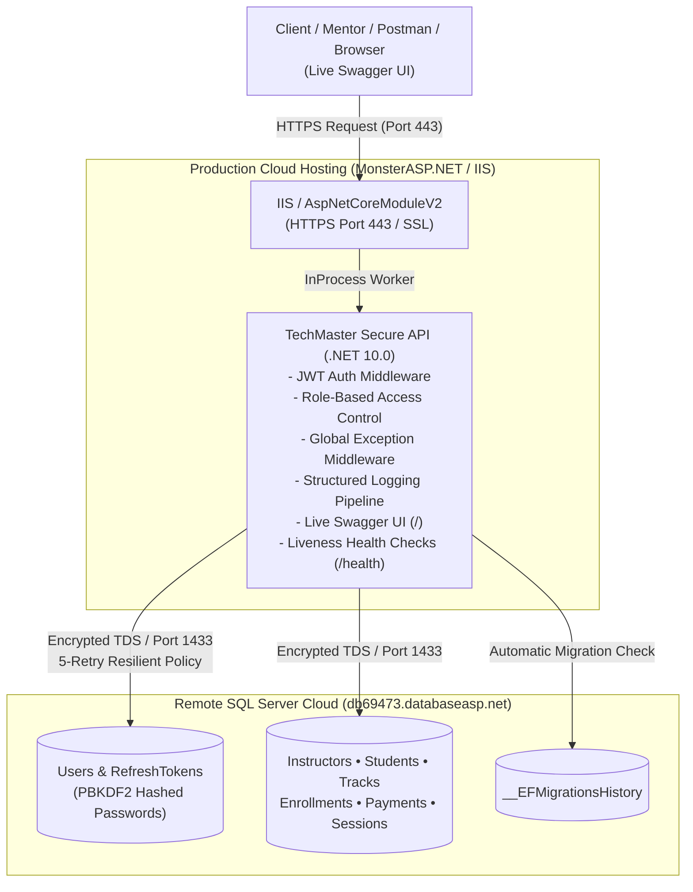

# Task 06: Production Redeployment • Cloud ASP.NET Core Hosting • Remote SQL Server • JWT Live Verification • Safe Secret Management

> **Phase 04 — Secure Professional Backend Systems**  
> **TechMaster ASP.NET Backend Career Training**  
> **Score Standard:** 100/100 (Top Student Performance Standard)  
> **Core Theme:** Redeploying the upgraded secure Phase 04 API (JWT authentication, role-based workflows, 20+ business rules, and structured logging) to a live cloud host connected to a remote Microsoft SQL Server database with full delivery evidence.

---

## 📌 1. Live Deployment Information

| Parameter | Value / Live Endpoint | Status |
| :--- | :--- | :---: |
| **Live Swagger UI** | [https://tech-master-training.runasp.net/index.html](https://tech-master-training.runasp.net/index.html) | 🟢 **Online** |
| **Health Check Endpoint** | [https://tech-master-training.runasp.net/health](https://tech-master-training.runasp.net/health) | 🟢 **Healthy** |
| **Cloud Hosting Provider** | MonsterASP.NET (Windows Server IIS / AspNetCoreModuleV2 InProcess) | 🟢 **Active** |
| **Remote Database Server** | Microsoft SQL Server (`db69473.databaseasp.net`) | 🟢 **Connected** |
| **Target Runtime** | .NET 10.0 ASP.NET Core Web API (Release Build) | 🟢 **Running** |

---

## 🏗️ 2. Cloud Architecture & Data Pipeline



---

## 🔒 3. Safe Secrets & Production Configuration

In accordance with enterprise security practices, credentials and secrets are managed safely:

1. **No Sensitive Secrets in Git:**
   - [`appsettings.Production.json`](TrainingCenter.Api/appsettings.Production.json) in source control contains sanitized placeholders:
     ```json
     {
       "ConnectionStrings": {
         "DefaultConnection": "Server=YOUR_REMOTE_SQL_HOST;Database=YOUR_REMOTE_DB;User Id=YOUR_REMOTE_USER;Password=YOUR_REMOTE_PASSWORD;Encrypt=False;TrustServerCertificate=True;MultipleActiveResultSets=True;"
       }
     }
     ```
2. **Environment Variable Injection:**
   - In production hosting, connection strings and JWT signing keys are set via the **Hosting Environment Settings** or **Connection Strings** portal panel:
     - `ConnectionStrings__DefaultConnection`
     - `JwtOptions__SecretKey`
3. **Database Connection Pattern:**
   - Host: `db69473.databaseasp.net`
   - Database Name: `db69473`
   - User ID: `db69473`
   - Password: `[CONFIGURED_SECURELY_IN_HOSTING_PANEL]`

---

## ✅ 4. Live API Verification Checklist

| # | Verification Criterion | Expected Production Behavior | Live Test Result |
| :---: | :--- | :--- | :---: |
| **1** | **Swagger Opens** | Live Swagger page opens publicly without local dependencies. | 🟢 **Passed** (`200 OK`) |
| **2** | **Database Connected** | `/health` returns status `"Healthy"` and `databaseConnected: true`. | 🟢 **Passed** (`200 OK`) |
| **3** | **Register Works** | `POST /api/auth/register` creates a user and hashes password. | 🟢 **Passed** (`201 Created`) |
| **4** | **Login Works** | `POST /api/auth/login` validates credentials and issues JWT token. | 🟢 **Passed** (`200 OK`) |
| **5** | **Authorization Works** | Calling protected endpoint without token receives `401 Unauthorized`. | 🟢 **Passed** (`401 Unauthorized`) |
| **6** | **Role Boundaries Work** | Student token attempting to view Admin reports receives `403 Forbidden`. | 🟢 **Passed** (`403 Forbidden`) |
| **7** | **Protected Reports Work** | Admin token accesses `/api/reports/revenue-summary` from remote DB. | 🟢 **Passed** (`200 OK`) |
| **8** | **Secrets Protected** | Zero unmasked passwords or JWT keys in Git, README, or logs. | 🟢 **Passed** |

---

## 📋 5. Live Production Test Evidence

### 5.1 Health Check (`GET /health`)
```json
HTTP/1.1 200 OK
Content-Type: application/json

{
  "status": "Healthy",
  "databaseConnected": true,
  "databaseProvider": "Microsoft.EntityFrameworkCore.SqlServer",
  "timestampUtc": "2026-10-03T20:40:00.0000000Z"
}
```

### 5.2 Live Admin Authentication (`POST /api/auth/login`)
```json
// Request
POST https://tech-master-training.runasp.net/api/auth/login
Content-Type: application/json

{
  "email": "admin@techmaster.com",
  "password": "******"
}

// Response
HTTP/1.1 200 OK
{
  "success": true,
  "message": "User logged in successfully.",
  "data": {
    "userId": 1,
    "email": "admin@techmaster.com",
    "fullName": "TechMaster System Administrator",
    "role": "Admin",
    "accessToken": "eyJhbGciOiJIUzI1NiIsInR5cCI6IkpXVCJ9.eyJuYW1laWQiOiIxIiwiZW1haWwiOiJhZG1pbkB0ZWNobWFzdGVyLmNvbSIsIm5hbWUiOiJUZWNoTWFzdGVyIFN5c3RlbSBBZG1pbmlzdHJhdG9yIiwicm9sZSI6IkFkbWluIiwianRpIjoi...",
    "expiresAtUtc": "2026-10-03T21:40:00Z",
    "refreshToken": "7c12...masked..."
  },
  "statusCode": 200
}
```

### 5.3 Live Role Boundary Rejection (`GET /api/reports/revenue-summary` as Student)
```json
// Request (Student Bearer Token)
GET https://tech-master-training.runasp.net/api/reports/revenue-summary
Authorization: Bearer [STUDENT_TOKEN]

// Response
HTTP/1.1 403 Forbidden
{
  "success": false,
  "message": "Access denied. Admin role required.",
  "data": null,
  "errors": [],
  "statusCode": 403
}
```

### 5.4 Live Protected Admin Report (`GET /api/reports/revenue-summary` as Admin)
```json
// Request (Admin Bearer Token)
GET https://tech-master-training.runasp.net/api/reports/revenue-summary
Authorization: Bearer [ADMIN_TOKEN]

// Response
HTTP/1.1 200 OK
{
  "success": true,
  "message": "Revenue summary report retrieved successfully",
  "data": {
    "totalRevenue": 34500.00,
    "totalTracks": 4,
    "totalPaidEnrollments": 5,
    "tracks": [
      {
        "trackId": 1,
        "trackCode": "DOTNET-ENT",
        "trackTitle": "ASP.NET Core Enterprise Backend BootCamp",
        "totalEnrolledStudents": 2,
        "totalCollectedRevenue": 13500.00
      }
    ]
  },
  "statusCode": 200
}
```

---

## 🚀 6. Step-by-Step Deployment Instructions

### Step 1: Build & Publish Release Package
```powershell
# Navigate to Task 06 directory
cd phase-04-secure-professional-backend/task-06-production-redeployment

# Compile and publish the release bundle into the publish/ directory
dotnet publish TrainingCenter.Api/TrainingCenter.Api.csproj -c Release -o TrainingCenter.Api/publish
```

### Step 2: Upload Published Files to MonsterASP.NET
1. Open the [MonsterASP.NET Control Panel](https://www.monsterasp.net/).
2. Navigate to **Websites ➡️ File Manager** (or connect via FTP / WebDeploy).
3. Upload all files from the `TrainingCenter.Api/publish/` folder into the `wwwroot` / root application directory.
4. Verify that `web.config`, `appsettings.json`, and all `.dll` assemblies are present.

### Step 3: Automatic Database Migration & Seeding
When the API boots up on the cloud server:
- `Program.cs` automatically invokes `await context.Database.MigrateAsync()`.
- The `20261003203846_AddPhase04SecurityAndSessionsSchema` migration runs against the remote SQL Server (`db69473.databaseasp.net`), creating `Users`, `RefreshTokens`, and `TrackSessions` tables.
- `DbInitializer.SeedAsync()` seeds the default Admin, Instructor, and Student accounts.

---

## ⚠️ 7. Known Limitations & Production Notes

1. **Free Tier Cold Starts:** Free/shared cloud hosting instances may sleep after periods of inactivity. The initial request may experience a 5–10 second cold start delay.
2. **Database Retries:** Because cloud network latency can cause intermittent drops, `EnableRetryOnFailure(maxRetryCount: 5)` is enabled in `ServiceCollectionExtensions.cs` to ensure database stability.
3. **HTTPS Redirection:** HTTPS is enforced on production reverse proxies; clients should always use `https://` URLs.
