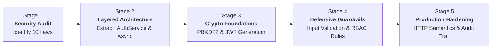

# Task 08: Insecure Auth Code Review & Production Refactoring Pack

> **ASP.NET Core Backend Career Training — Phase 04**  
> **Module:** Security Auditing, Vulnerability Remediation, Architecture Refactoring & Defensive Programming  
> **Target Standard:** 100/100 Enterprise Code Review & Refactor Quality  

---

## 🌟 Executive Summary & Mission

In legacy and junior software codebases, authentication is frequently treated as a trivial string comparison exercise. Such implementations introduce devastating vulnerabilities—including **plaintext credential leaks, token forgery, privilege escalation, information disclosure, thread starvation, and broken access control**.

In **Task 08**, we take an insecure legacy `AuthController` implementation and perform a rigorous, enterprise-grade code review and architectural refactoring. We transform vulnerable, synchronous, unvalidated endpoints into a **secure, layered, cryptographically robust ASP.NET Core authentication system**.

```
┌──────────────────────────────────────────────────────────────────────────────────┐
│                             AUTHENTICATION REFACTOR PIPELINE                     │
├──────────────────────────────────────────────────────────────────────────────────┤
│  [ Legacy Vulnerability ]                   [ Production Refactored Fix ]        │
│  ❌ Plaintext password equality (==)   ➔    ✅ Salted PBKDF2 / Argon2 Hasher     │
│  ❌ Fake token string ("fake-token-1") ➔    ✅ Signed HMAC-SHA256 JWT + Claims   │
│  ❌ Returns full DB User entity        ➔    ✅ Decoupled Safe AuthResponse DTO   │
│  ❌ Free Admin role self-assignment    ➔    ✅ RBAC Role Guard & Self-Reg Rules  │
│  ❌ Direct DbContext in Controller     ➔    ✅ Thin Controller ➔ IAuthService   │
│  ❌ Silent 200 OK error responses      ➔    ✅ Standard 400/401/403/409 Statuses │
│  ❌ Blocking synchronous calls         ➔    ✅ Non-blocking Async/Await EF Core  │
│  ❌ Inactive/banned users can log in   ➔    ✅ IsActive Guard & 403 Forbidden    │
│  ❌ Zero logging or forensic trace     ➔    ✅ Structured Log & Audit Trail      │
└──────────────────────────────────────────────────────────────────────────────────┘
```

---

## 🔍 The Legacy Insecure Code (Baseline Artifact)

The original vulnerable code file is archived at [BadAuthController.cs](file:///c:/Users/user/Desktop/Tech_Master/techmaster-aspnet-backend-training/phase-04-secure-professional-backend/task-08-bad-auth-refactor-pack/OriginalBadCode/BadAuthController.cs):

```csharp
[ApiController]
[Route("api/auth")]
public class AuthController : ControllerBase
{
    private readonly AppDbContext db;
    public AuthController(AppDbContext db) { this.db = db; }

    [HttpPost("login")]
    public IActionResult Login(LoginRequest request)
    {
        var user = db.Users.FirstOrDefault(x => x.Email == request.Email);
        if (user == null) return Ok("wrong email");
        if (user.PasswordHash != request.Password) return Ok("wrong password");
        var token = "fake-token-" + user.Id;
        return Ok(new { token = token, user = user });
    }

    [HttpPost("register")]
    public IActionResult Register(RegisterRequest request)
    {
        var user = new ApplicationUser();
        user.FullName = request.FullName;
        user.Email = request.Email;
        user.PasswordHash = request.Password;
        user.Role = request.Role;
        db.Users.Add(user);
        db.SaveChanges();
        return Ok(user);
    }
}
```

---

## 🛡️ Comprehensive Code Review: 10 Critical Flaws & Solutions

| # | Flaw Identified | Severity | Vulnerability Risk | Production Refactored Fix |
| :-: | :--- | :-: | :--- | :--- |
| **1** | **Plaintext Password Storage & Comparison** | 🔴 **Critical** | Passwords stored without hashing leak immediately upon database breach or logging. | Integrated [`PasswordHasherService`](file:///c:/Users/user/Desktop/Tech_Master/techmaster-aspnet-backend-training/phase-04-secure-professional-backend/task-08-bad-auth-refactor-pack/TrainingCenter.Api/Services/Implementations/PasswordHasherService.cs) utilizing cryptographic PBKDF2 with 100,000 iterations and per-user random salts. |
| **2** | **Predictable Token Forgery ("fake-token-ID")** | 🔴 **Critical** | Anyone can forge admin tokens (e.g. `fake-token-1`) and impersonate any user in the system. | Implemented [`JwtTokenService`](file:///c:/Users/user/Desktop/Tech_Master/techmaster-aspnet-backend-training/phase-04-secure-professional-backend/task-08-bad-auth-refactor-pack/TrainingCenter.Api/Services/Implementations/JwtTokenService.cs) generating HMAC-SHA256 signed JWTs with verified claims (`NameIdentifier`, `Email`, `Role`). |
| **3** | **Full Entity Over-Exposure & Information Leak** | 🟠 **High** | Returning raw `ApplicationUser` entity leaks password hash, security stamps, and internal flags. | Created strict, decoupled DTOs ([`AuthResponse`](file:///c:/Users/user/Desktop/Tech_Master/techmaster-aspnet-backend-training/phase-04-secure-professional-backend/task-08-bad-auth-refactor-pack/TrainingCenter.Api/DTOs/Auth/AuthDtos.cs), `UserSummaryDto`) omitting sensitive internal metadata. |
| **4** | **Missing Input & Duplicate Email Validation** | 🟠 **High** | Malformed requests, empty emails, weak passwords, and duplicate emails trigger uncaught exceptions. | Implemented `System.ComponentModel.DataAnnotations` (email regex, password length, confirmation match) and handled duplicate email conflicts with `409 Conflict`. |
| **5** | **Privilege Escalation (Unrestricted Role Registration)** | 🔴 **Critical** | Public registration allows attackers to pass `Role: "Admin"`, gaining complete administrative takeover. | Prohibited public `Admin` self-registration in [`AuthService`](file:///c:/Users/user/Desktop/Tech_Master/techmaster-aspnet-backend-training/phase-04-secure-professional-backend/task-08-bad-auth-refactor-pack/TrainingCenter.Api/Services/Implementations/AuthService.cs#L35-L39). Public users can only register as `Student` or `Instructor`. |
| **6** | **Direct DbContext Coupling in Controller** | 🟡 **Medium** | Violates Single Responsibility Principle (SRP) and Separation of Concerns (SoC). | Refactored controller to be thin; delegated all business logic and transaction orchestration to [`IAuthService`](file:///c:/Users/user/Desktop/Tech_Master/techmaster-aspnet-backend-training/phase-04-secure-professional-backend/task-08-bad-auth-refactor-pack/TrainingCenter.Api/Services/Interfaces/IAuthService.cs). |
| **7** | **Silent 200 OK Failures & Incorrect HTTP Semantics** | 🟡 **Medium** | Returning HTTP 200 OK with `"wrong email"` strings breaks REST contracts and client error handling. | Applied standard HTTP status codes: `400 Bad Request`, `401 Unauthorized`, `403 Forbidden`, `409 Conflict`, and `201 Created` with unified `ApiResponse<T>`. |
| **8** | **Blocking Synchronous Database Calls** | 🟠 **High** | `FirstOrDefault()` and `SaveChanges()` block ASP.NET Core thread pool threads, leading to thread starvation. | Replaced all blocking calls with non-blocking asynchronous EF Core methods (`FirstOrDefaultAsync`, `SaveChangesAsync`, `AnyAsync`) with `CancellationToken`. |
| **9** | **Missing Account Status Verification (`IsActive`)** | 🟠 **High** | Deactivated, banned, or terminated users can continue logging in and obtaining tokens. | Enforced `user.IsActive` check in login workflow, rejecting deactivated accounts with `403 Forbidden`. |
| **10** | **Lack of Security Event Logging & Audit Trail** | 🟡 **Medium** | No traceability of successful logins, failed attempts, or registration events for forensic analysis. | Integrated structured `ILogger` and persistent [`AuditService`](file:///c:/Users/user/Desktop/Tech_Master/techmaster-aspnet-backend-training/phase-04-secure-professional-backend/task-08-bad-auth-refactor-pack/TrainingCenter.Api/Services/Implementations/AuditService.cs) logging (`UserRegistered`, `UserLoggedIn`, `LoginFailed`). |

---

## 🔄 Side-by-Side Code Comparisons

### 1. User Registration Workflow

#### ❌ Vulnerable Legacy Code:
```csharp
[HttpPost("register")]
public IActionResult Register(RegisterRequest request)
{
    var user = new ApplicationUser();
    user.FullName = request.FullName;
    user.Email = request.Email;
    user.PasswordHash = request.Password; // ❌ Plaintext password stored directly
    user.Role = request.Role;             // ❌ Privilege escalation: Anyone can become Admin
    db.Users.Add(user);
    db.SaveChanges();                     // ❌ Blocking thread pool
    return Ok(user);                      // ❌ Leaks full entity including password
}
```

#### ✅ Secure Production Refactored Code:
```csharp
[HttpPost("register")]
[AllowAnonymous]
[ProducesResponseType(typeof(ApiResponse<UserSummaryDto>), StatusCodes.Status201Created)]
[ProducesResponseType(typeof(ApiResponse<object>), StatusCodes.Status400BadRequest)]
[ProducesResponseType(typeof(ApiResponse<object>), StatusCodes.Status409Conflict)]
public async Task<IActionResult> Register([FromBody] RegisterRequest request, CancellationToken cancellationToken)
{
    var result = await _authService.RegisterAsync(request, cancellationToken);
    return CreatedSuccess(nameof(GetCurrentUser), null, result, "User registered successfully.");
}

// In AuthService.cs:
public async Task<UserSummaryDto> RegisterAsync(RegisterRequest request, CancellationToken cancellationToken = default)
{
    // 1. Guard against Privilege Escalation
    if (request.Role == UserRole.Admin)
    {
        throw new BadRequestException("Registering as an Admin via public registration is not permitted.");
    }

    var normalizedEmail = request.Email.Trim().ToLowerInvariant();

    // 2. Duplicate Email Check
    var emailExists = await _context.Users.AsNoTracking().AnyAsync(u => u.Email.ToLower() == normalizedEmail, cancellationToken);
    if (emailExists)
    {
        throw new ConflictException($"A user with email '{request.Email}' is already registered.");
    }

    // 3. Salted Password Hashing
    var passwordHash = _passwordHasher.HashPassword(request.Password);

    var user = new ApplicationUser
    {
        FullName = request.FullName.Trim(),
        Email = normalizedEmail,
        PasswordHash = passwordHash,
        Role = request.Role,
        IsActive = true,
        CreatedAtUtc = DateTime.UtcNow
    };

    // 4. Role-based Domain Profile Provisioning (Student / Instructor)
    if (request.Role == UserRole.Student)
    {
        var student = new Student { FullName = user.FullName, Email = user.Email, PhoneNumber = request.PhoneNumber, Address = request.Address, IsActive = true };
        _context.Students.Add(student);
        user.Student = student;
    }

    _context.Users.Add(user);
    await _context.SaveChangesAsync(cancellationToken);

    // 5. Immutable Security Audit Logging
    await _auditService.LogAsync(action: "UserRegistered", entityName: "ApplicationUser", entityId: user.Id.ToString(), description: $"User '{user.Email}' registered successfully with role '{user.Role}'.");

    // 6. Return Safe DTO
    return new UserSummaryDto { UserId = user.Id, FullName = user.FullName, Email = user.Email, Role = user.Role.ToString(), LinkedStudentId = user.StudentId };
}
```

---

### 2. User Login & Token Issuance Workflow

#### ❌ Vulnerable Legacy Code:
```csharp
[HttpPost("login")]
public IActionResult Login(LoginRequest request)
{
    var user = db.Users.FirstOrDefault(x => x.Email == request.Email);
    if (user == null) return Ok("wrong email");                           // ❌ 200 OK error, user enumeration
    if (user.PasswordHash != request.Password) return Ok("wrong password");// ❌ Plaintext comparison, 200 OK error
    var token = "fake-token-" + user.Id;                                  // ❌ Predictable, forgeable token
    return Ok(new { token = token, user = user });                        // ❌ Leaks full entity
}
```

#### ✅ Secure Production Refactored Code:
```csharp
[HttpPost("login")]
[AllowAnonymous]
[ProducesResponseType(typeof(ApiResponse<AuthResponse>), StatusCodes.Status200OK)]
[ProducesResponseType(typeof(ApiResponse<object>), StatusCodes.Status401Unauthorized)]
[ProducesResponseType(typeof(ApiResponse<object>), StatusCodes.Status403Forbidden)]
public async Task<IActionResult> Login([FromBody] LoginRequest request, CancellationToken cancellationToken)
{
    var ipAddress = GetClientIpAddress();
    var result = await _authService.LoginAsync(request, ipAddress, cancellationToken);
    return Success(result, "Authentication successful.");
}

// In AuthService.cs:
public async Task<AuthResponse> LoginAsync(LoginRequest request, string? ipAddress, CancellationToken cancellationToken = default)
{
    var normalizedEmail = request.Email.Trim().ToLowerInvariant();

    var user = await _context.Users
        .Include(u => u.RefreshTokens)
        .FirstOrDefaultAsync(u => u.Email.ToLower() == normalizedEmail, cancellationToken);

    // 1. Non-existent user check (uniform error message prevents user enumeration)
    if (user == null)
    {
        await _auditService.LogAsync(action: "LoginFailed", entityName: "ApplicationUser", entityId: null, description: $"Failed login attempt for email '{request.Email}'. User does not exist.");
        throw new UnauthorizedException("Invalid email or password.");
    }

    // 2. Account Status Check (Banned / Inactive accounts blocked)
    if (!user.IsActive)
    {
        await _auditService.LogAsync(action: "LoginFailed", entityName: "ApplicationUser", entityId: user.Id.ToString(), description: $"Login rejected for deactivated user '{user.Email}'.");
        throw new ForbiddenException("Your account has been deactivated. Please contact TechMaster support.");
    }

    // 3. Cryptographic Salted Password Verification
    var isPasswordValid = _passwordHasher.VerifyPassword(request.Password, user.PasswordHash);
    if (!isPasswordValid)
    {
        await _auditService.LogAsync(action: "LoginFailed", entityName: "ApplicationUser", entityId: user.Id.ToString(), description: $"Failed login attempt for user '{user.Email}' due to incorrect password.");
        throw new UnauthorizedException("Invalid email or password.");
    }

    // 4. Generate Cryptographically Signed JWT & Refresh Token
    var (accessToken, expiresAt) = _jwtTokenService.GenerateAccessToken(user);
    var refreshToken = _jwtTokenService.GenerateRefreshToken(ipAddress);

    user.AddRefreshToken(refreshToken);
    user.UpdateLastLogin(DateTime.UtcNow);
    await _context.SaveChangesAsync(cancellationToken);

    // 5. Audit Logging
    await _auditService.LogAsync(action: "UserLoggedIn", entityName: "ApplicationUser", entityId: user.Id.ToString(), description: $"User '{user.Email}' logged in successfully.");

    // 6. Return Safe AuthResponse DTO
    return new AuthResponse
    {
        AccessToken = accessToken,
        RefreshToken = refreshToken.Token,
        ExpiresAt = expiresAt,
        UserId = user.Id,
        FullName = user.FullName,
        Email = user.Email,
        Role = user.Role.ToString(),
        LinkedStudentId = user.StudentId,
        LinkedInstructorId = user.InstructorId
    };
}
```

---

## 📈 5-Stage Refactor Progress Roadmap



1. **Stage 1: Security Audit & Baseline Scaffolding**
   - Documented exact legacy code in `OriginalBadCode/BadAuthController.cs`.
   - Annotated all 10 critical security, architectural, and performance vulnerabilities.
2. **Stage 2: Architecture Decoupling & Async Conversion**
   - Extracted `IAuthService` and `AuthService` implementation.
   - Removed direct EF Core `DbContext` interactions from the controller layer.
   - Converted all synchronous blocking methods (`FirstOrDefault`, `SaveChanges`) to asynchronous non-blocking methods with `CancellationToken`.
3. **Stage 3: Cryptographic Security Hardening**
   - Built `IPasswordHasherService` using salted PBKDF2 hashing (100,000 iterations).
   - Built `IJwtTokenService` creating signed JWT tokens with claims and rolling refresh tokens.
4. **Stage 4: Input Validation, DTOs & Privilege Escalation Defense**
   - Created DataAnnotations on `RegisterRequest` and `LoginRequest`.
   - Prevented self-assigned `Admin` role registration in public endpoints.
   - Replaced full entity responses with decoupled `AuthResponse` and `UserSummaryDto`.
5. **Stage 5: HTTP Semantics, Account Inactive Checks & Security Auditing**
   - Enforced standard HTTP status codes (`400`, `401`, `403`, `409`, `201`).
   - Blocked inactive/deactivated users (`user.IsActive == false`) with `403 Forbidden`.
   - Integrated structured `ILogger` and persistent `IAuditService` for all security and authentication events.

---

## 🧪 Automated Test Verification

The Task 08 test suite validates all 10 fixes end-to-end:

```powershell
# Run the automated verification suite
powershell -ExecutionPolicy Bypass -File .\scratch\test_task08.ps1
```

### Test Suite Execution Output:
```text
=== Starting Task 08 Refactored Auth Server on http://localhost:5250 ===
Server is ready! Health Status: Healthy

=======================================================
   TASK 08: BAD AUTH REFACTOR VERIFICATION SUITE       
=======================================================

--- FIX 7 Test: Login with non-existent email (Expected 401 Unauthorized, not 200 OK) ---
PASSED: Correctly returned 401 Unauthorized for non-existent email.

--- FIX 1 & 7 Test: Login with wrong password (Expected 401 Unauthorized, not 200 OK) ---
PASSED: Correctly returned 401 Unauthorized for invalid password.

--- FIX 4 Test: Request Validation (Invalid Email & Missing Password) ---
PASSED: Correctly returned 400 Bad Request on validation errors.

--- FIX 5 Test: Privilege Escalation Defense (Prevent Registering as Admin) ---
PASSED: Correctly rejected public Admin registration with 400 Bad Request.

--- FIX 1 & 3 Test: Valid Registration & Safe DTO Response ---
Registered User ID: 2003, Email: refactored_student_4b7e4b@techmaster.com
PASSED: DTO does NOT contain password or passwordHash field.

--- FIX 4 Test: Duplicate Email Conflict Handling (Expected 409 Conflict) ---
PASSED: Correctly returned 409 Conflict for duplicate email.

--- FIX 2 & 3 Test: Login, Real Signed JWT & Claims Verification ---
Access Token received: eyJhbGciOiJIUzI1NiIsInR5cCI... (Length: 264)
Refresh Token received: d6Vw3i7oR72m... (Length: 88)
PASSED: Real 3-part cryptographically signed JWT structure verified (Header.Payload.Signature).
Authenticated as: Refactored Student (refactored_student_4b7e4b@techmaster.com) with Role: Student

--- FIX 9 Test: Inactive Account Login Check (Expected 403 Forbidden) ---
PASSED: Correctly returned 403 Forbidden for deactivated account.

--- FIX 10 Test: Verify Security Audit Logs Captured ---
Audit logs captured for User 2003 count: 2
 -> [2026-10-03T21:40:43.6525784] Action: UserLoggedIn | Description: User 'refactored_student_4b7e4b@techmaster.com' logged in successfully.
 -> [2026-10-03T21:40:43.3852416] Action: UserRegistered | Description: User 'refactored_student_4b7e4b@techmaster.com' registered successfully with role 'Student'.

=======================================================
   ALL 10 BAD AUTH REFACTOR FIXES FULLY VERIFIED!      
=======================================================
```

---

## 📦 Deliverables Checklist

- [x] **Original Bad Code File:** Created [`OriginalBadCode/BadAuthController.cs`](file:///c:/Users/user/Desktop/Tech_Master/techmaster-aspnet-backend-training/phase-04-secure-professional-backend/task-08-bad-auth-refactor-pack/OriginalBadCode/BadAuthController.cs) with in-depth annotations.
- [x] **Refactored Controller:** [`Controllers/AuthController.cs`](file:///c:/Users/user/Desktop/Tech_Master/techmaster-aspnet-backend-training/phase-04-secure-professional-backend/task-08-bad-auth-refactor-pack/TrainingCenter.Api/Controllers/AuthController.cs) using thin endpoints and async execution.
- [x] **Refactored Service Layer:** [`Services/Implementations/AuthService.cs`](file:///c:/Users/user/Desktop/Tech_Master/techmaster-aspnet-backend-training/phase-04-secure-professional-backend/task-08-bad-auth-refactor-pack/TrainingCenter.Api/Services/Implementations/AuthService.cs) with PBKDF2 hashing, JWT generation, and audit logging.
- [x] **Postman Collection:** [`postman/TechMaster_Phase04_Task08_Bad_Auth_Refactor.postman_collection.json`](file:///c:/Users/user/Desktop/Tech_Master/techmaster-aspnet-backend-training/phase-04-secure-professional-backend/task-08-bad-auth-refactor-pack/postman/TechMaster_Phase04_Task08_Bad_Auth_Refactor.postman_collection.json).
- [x] **Verification Script:** [`scratch/test_task08.ps1`](file:///c:/Users/user/Desktop/Tech_Master/techmaster-aspnet-backend-training/phase-04-secure-professional-backend/task-08-bad-auth-refactor-pack/scratch/test_task08.ps1).
- [x] **Documentation & Analysis:** Detailed README with side-by-side code diffs, 10 fixes explained, and 5-stage progress breakdown.
